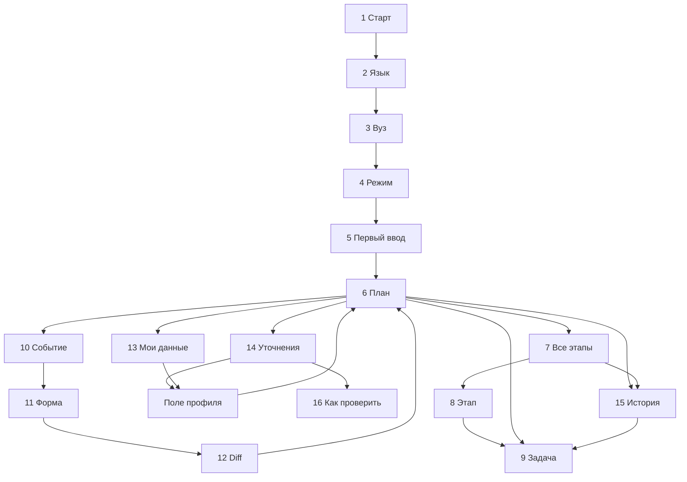

# Рядом — финальная UI/UX-логика mini-app

**Версия:** 28.09.2026 · **Назначение:** контракт дизайна и разработки нового student presentation layer поверх работающего MVP.  
**Визуальный snapshot:** только финальные коллажи **A: экраны 1–12** и **B: экраны 13–16**, повторно приложенные к задаче. Изображение главного экрана крупно и более ранние коллажи не используются как источник этой версии.  
**Статус:** целевая спецификация, а не утверждение о внедрении 16 экранов. Существующий компактный список и мобильная навигация проверены; новая экранная система требует реализации и приёмки в MAX.

## 1. Цель и статус документа

Рядом помогает иностранному студенту СПбГУПТД или СПбГЭТУ «ЛЭТИ» понять следующий шаг и параллельные задачи, а после подтверждённого события перестраивает персональный roadmap с историей. Макеты определяют композицию, экранные роли и действия. **Числа, даты, списки, статусы и история на них — showcase**, а не fixture продукта. UI строится из профиля, подтверждённых событий, версий федеральных и вузовских правил и результата существующего детерминированного движка.

Документ не меняет десять семейств задач, eligibility, правовые правила, роли, административную публикацию, хранилище и MAX-интеграцию. Он фиксирует отображение, маршруты, состояния и реакции на API. В частности, несходство нарисованных `1 из 2`/`1 из 3` или сюжет события **не требует переделывать макет**: реальное число и результат вычисляются из актуального snapshot/diff. Разработчик сохраняет визуальную структуру двух коллажей и следует динамической логике ниже.

## 2. Source of truth hierarchy

| Вопрос | Приоритетный источник | Следствие для UI |
|---|---|---|
| Продукт, scope, статусы, события, четыре типа дат, privacy | `PROJECT_CONTEXT.md` как вводная; затем **`max_foreign_students_developer_handoff_MASTER_FINAL_2026-09-27.md`** как норматив продукта | При конфликте showcase текста с MASTER FINAL действует MASTER FINAL. |
| Существующие механики и проверенное поведение | `CODE_MAP.md`, `IMPLEMENTATION_STATUS.md`, `MAX_ACCEPTANCE_2026_09_28.md`, `UI_REDESIGN_2026_09_28.md`, `DEMO_PROFILES.md` | Карта кода не доказывает конкретный payload без исходника; отчёт о проверке прежнего UI не доказывает новый экран. |
| Сроки, применимость, документы, вузовский контакт | `foreign_students_rules_research_spbgutd_leti_2026.md` и его первоисточники | UI не вычисляет юридический срок из одного профиля; не переносит пакет/канал между вузами. |
| Выявленные несходства прототипа | `ryadom_predevelopment_screen_acceptance_2026-09-28.md` | Превратить в правила динамического отображения. Изображения не перерисовывать ради статических чисел. |
| Требования к проверяемому сценарию | `Забота о людях.pdf`, `Общий FAQ.pdf` | Основной путь доступен в MAX через HTTPS; mock-интеграции и модельная публикация явно названы. |
| Композиция, визуальная иерархия, имена 16 экранов | Два финальных коллажа A/B | Не копировать из них неподтверждённые данные или фиктивное состояние. |

Работающий MVP уже содержит roadmap двух вузов, сохранение профиля/статусов, события с исправлением/отменой, историю, RU/EN, модельного редактора, версии правил, diff/outbox. MAX вход, сохранение статуса после повторного открытия и полученное уведомление от модельной публикации проверены. **Новый** UI, полный event flow в настоящем MAX-аккаунте и каждый deep link после редизайна должны быть проверены отдельно. Внутренних интеграций с вузами, МВД или ЕСИА нет; student completion — self-report.

## 3. Information Architecture

| Нижняя вкладка | Корневой экран | Вложенные экраны и действия |
|---|---|---|
| **План** | **6 Home** | **7 Все этапы → 8 Этап → 9 Детали задачи**; **6/7 → 15 История**; **6 → 14 Нужно уточнить → 16 Как проверить**. Hero 6 и строка в 8 открывают **одну** 9. |
| **Событие** | **10 Сообщить событие** | Выбор поддерживаемого типа → **11 форма** соответствующего события → **12 фактический diff** → обновлённый 6/8. Исправление/отмена существующего события открывают 11 с соответствующим режимом и приводят к новому diff. |
| **Мои данные** | **13 Профиль** | Редактирование одного поля в sheet, группы или факта с отдельной формой; `conditional` из 14 может открыть сразу нужный редактор. Подтверждение регистрации/получение новой визы пишется через типизированное событие, а не незаметной заменой истории. |

**1–5** — линейный первый ввод поверх ещё не созданного/неполного профиля. **15** находится в ветке «План»: компактная ссылка «История» у блока маршрута на 6 и в верхней панели 7 ведёт туда; нижняя вкладка остаётся «План». Это два входа к одному экрану, не четвёртый раздел. **14** открывается из агрегата «Нужно уточнить», а карточка внутри него ведёт либо к нужному полю, либо к 16. **16** — полноценный короткий detail с источником и контактом.

Колокольчик с красной точкой на 6 — часть showcase композиции, но существование собственного student inbox не подтверждено. **В релизном UI не рендерить его**, пока нет проверенного действия; MAX-уведомления открывают задачу или план через deep link. Это скрытие элемента, а не новая интеграция или новый раздел.

## 4. Global Navigation

1. Нижняя навигация меняет корень (`План`, `Событие`, `Мои данные`); повторный тап текущей вкладки возвращает к её корню. При обычном переключении сохраняются кратковременные scroll/filter каждого корня в текущей сессии; данные всегда перечитываются из актуального серверного snapshot при возврате после мутации.
2. На вложенном экране стрелка Back закрывает один уровень внутри исходной вкладки. На 9 возвращает именно в 8, если вход был из 8, либо в 6, если из hero; на 16 — в 14. Back на 12 возвращает к обновлённому плану, а **не** повторяет POST и не возвращает к форме как будто она не сохранена.
3. Незаписанный черновик формы 11/редактора 13 хранится в памяти текущего процесса UI. Back с изменениями вызывает выбор «Продолжить редактирование / Не сохранять»; уход по нижней вкладке подчиняется тому же правилу. Черновик не является подтверждённым событием и не меняет roadmap.
4. После успешного POST сбросить pending/disable CTA, использовать idempotency key и заменить экран 11 на результат 12 в стеке. Refresh/reopen читает серверное состояние; историю нельзя строить из памяти страницы.
5. При входе по MAX deep link сначала серверная проверка launch data/сессии, затем разрешение target. Если target уже `superseded`, открыть read-only историческую задачу с объяснением и переходом в текущий план; если неизвестен — открыть 6 с нейтральным сообщением. После этого Back внутри mini-app ведёт в План, не на пустую страницу.

## 5. Navigation Map



`MAX notification → auth → target task 9 / target diff 12 / updated Plan 6` в зависимости от существующего deep link и доступности ревизии. Стрелки диаграммы описывают экранные переходы, **не юридическую последовательность задач**. Из будущего этапа можно открыть задачу без завершения предыдущего.

## 6. Screen Inventory

| № | Экран | Путь / вкладка | Представление |
|---:|---|---|---|
| 1 | Старт | `/onboarding/start` | full screen |
| 2 | Язык | `/onboarding/language` | full screen |
| 3 | Вуз | `/onboarding/university` | full screen |
| 4 | Тип въезда | `/onboarding/entry-type` | full screen |
| 5 | Первый маршрут | `/onboarding/initial-data` | full screen |
| 6 | Главный «План» | `/plan` | tab root |
| 7 | Все этапы | `/plan/stages` | full screen |
| 8 | Деталь этапа | `/plan/stages/:stage` | full screen |
| 9 | Задача | `/plan/tasks/:taskKey` | full screen на телефоне |
| 10 | Сообщить событие | `/event` | tab root |
| 11 | Форма события | `/event/:type` | full screen |
| 12 | Результат события | `/event/result/:revision` | full screen, read-only |
| 13 | Мои данные | `/profile` | tab root |
| 14 | Нужно уточнить | `/plan/clarifications` | full screen |
| 15 | История | `/plan/history` | full screen |
| 16 | Как проверить | `/plan/clarifications/:taskKey` | full screen |

Пути выше — **UI route names**, не новые backend endpoints. `:taskKey`/`:revision` — безопасные внутренние идентификаторы; фактический URL/формат deep link согласовать с существующим роутером и OpenAPI. Доступ к чужому ID сервер запрещает.

## 7. Screen-by-screen specification 1–16

В каждом пункте **источник** означает данные приложения; **Back** включает сохранение UI-состояния из §4/18. Все чтения имеют `loading / loaded / error`, а запись — `idle / submitting / success / error`. Неудачная запись не притворяется успешной.

### 1. Сплэш / стартовый экран

- **Назначение / entry:** первый вход из mini-app или публичной тестовой ссылки, если ещё нет завершённого первого маршрута. Если профиль уже есть, пропустить 1–5 и открыть запрошенный deep link либо 6.
- **Источник / состояния:** результат server auth и наличие профиля; `auth_loading`, `new_user`, `returning_user`, `auth_error`. Экран не содержит данных MAX пользователя, пока они не проверены на сервере.
- **Блоки / CTA:** логотип, краткое обещание, «Начать». Тап ведёт в 2, данные не меняет. Если ожидание авторизации длиннее, показать спокойный индикатор; не держать обязательный splash после разрешения существующего профиля.
- **Back / успех / ошибка:** с 1 системный Back закрывает mini-app; после успешной авторизации переход зависит от профиля. При ошибке — «Повторить вход» с повторной авторизацией, не создавать анонимный реальный MAX-профиль.
- **Не hardcode:** будто каждый пользователь новый; идентичность, сохранённость профиля, скорость загрузки.

### 2. Выбор языка

- **Назначение / entry:** первый шаг нового onboarding; возврат из 3. Источник — текущий `profile.language` или локальный draft и доступные RU/EN.
- **Состояния / блоки:** RU/EN radio, выбранный язык, Continue; отсутствие выбранного языка допускает явный default RU только с видимым выбором. Тексты меняются сразу, введённые далее значения не сбрасываются.
- **CTA:** «Продолжить» сохраняет язык в draft и ведёт в 3; окончательная серверная запись вместе с разрешённым onboarding/profile update. Переключение из 13 позднее — отдельный edit с тем же словарём.
- **Back / успех / ошибка:** Back в 1 с сохранением выбора; при проблеме сервера не терять draft, повторить сохранение. Никакого AI-перевода правил при выборе EN.
- **Не hardcode:** RU как личный язык каждого MAX пользователя и английские переводы из картинки.

### 3. Выбор вуза

- **Назначение / entry:** после 2, Back из 4. Источник — два разрешённых tenant: СПбГУПТД и СПбГЭТУ «ЛЭТИ».
- **Состояния / блоки:** выбран/не выбран, только две карточки с официальным названием; неизвестный кампус/специальная площадка не делается третьим вузом.
- **CTA:** тап выбирает `university_id` в draft, «Продолжить» → 4. Сам выбор до завершения onboarding не публикует событие и не создаёт roadmap.
- **Back / успех / ошибка:** Back → 2, сохраняя выбор. Если университетская конфигурация недоступна, retry; не подменять вуз по умолчанию и не копировать локальные правила другого.
- **Не hardcode:** СПбГУПТД для всех, ИТМО, локальные тексты/контакты на frontend.

### 4. Тип въезда

- **Назначение / entry:** после 3, Back из 5. Источник — поддерживаемые значения `visa_regime`/основания из модели.
- **Состояния / блоки:** «Учебная виза», «Безвизовый въезд», «Другое». Выбор «Другое» заранее предупреждает: автоматическая учебная ветка ограничена, будет `needs_review` и контакт; не превращает её в визовую.
- **CTA:** выбор обновляет draft; Continue → 5. Следующий шаг задаёт только поля соответствующей ветки; гражданство само по себе не отождествлять с визовым режимом.
- **Back / успех / ошибка:** Back → 3 без потери значения. При ошибке валидации объяснить неподдерживаемую комбинацию и оставить возможность исправить.
- **Не hardcode:** автоматическую правовую применимость и сроки по одной радиокнопке.

### 5. Данные для первого маршрута

- **Назначение / entry:** после 4 либо возобновление незавершённого onboarding. Источник — draft языка/вуза/режима, существующие значения профиля при продолжении.
- **Состояния / блоки:** «Уже въехал / Планирую въезд»; соответствующая фактическая/плановая дата либо «Не знаю»; тип жилья `dorm/private/other/unknown`; `visa_expiry` только для визовой ветки и только если известен; согласие и ссылка на условия. Заполненное изображение — пример, не default. Нельзя заранее ставить согласие.
- **CTA:** Continue валидирует даты и согласие, сохраняет профиль; `entry_recorded` создаётся **только** при явно подтверждённом фактическом въезде согласно существующему серверному контракту. Планируемая дата остаётся планом. После success запросить roadmap и заменить onboarding корнем 6; не записывать дату `04.12.2026` всем.
- **Back / успех / ошибка:** Back → 4; draft значений остаётся. Field error рядом с полем; server/network error оставляет всё введённое и повторяет idempotent save. Без согласия нельзя отправлять профиль. При неизвестной дате показать условный первый маршрут без выдуманного срока.
- **Не hardcode:** дату въезда 12.09.2025, проживание, срок визы, автоматически завершённые задачи «До приезда», checked consent.

### 6. Главный экран «План»

- **Назначение / entry:** после первого результата, нажатие таба «План», результат 12, закрытие 9/14/15, MAX deep link fallback, возвращение в приложение.
- **Источник:** `profile` + один актуальный `roadmap snapshot` с задачами, статусами, временными значениями, eligibility reasons, версией и приоритетами. При обновлении после события/refetch все блоки получают **одну и ту же ревизию**, без смешения до/после.
- **Состояния / блоки:** контекстная карточка (вуз, режим, жильё), hero (либо безопасное empty-вариант), «Ваш маршрут» с тремя этапами и прогрессом, краткое уточнение с количеством, нижние три вкладки. `loading`, `no_roadmap`, `no_actionable`, `partial_unknown`, `offline/error` используют §17. Колокольчик до существования действия не показывать.
- **CTA:** контекст → 13; hero и «Открыть действие» → 9 с его `task_key`; тап этапа → 8, заголовок/ссылка «Все этапы» → 7; компактная «История» возле блока маршрута → 15; баннер или его строки → 14/соответствующее уточнение; вкладки → свои корни. Ничто на 6 само не меняет серверных данных.
- **Back / успех / ошибка:** после возвращения восстановить scroll, затем тихо обновить snapshot; loading skeleton не должен прыгать между вкладками. Ошибка чтения показывает retry и последние данные **только с меткой, что они не обновлены**; не утверждать актуальный дедлайн из кэша.
- **Не hardcode:** «1 из 3», названия задач, active stage, 2 уточнения, 05.10/04.12, учебную визу/общежитие, красную точку уведомлений. Алгоритмы — §8–9.

### 7. «Все этапы»

- **Назначение / entry:** заголовок/«Все этапы» на 6; маршрут в Плане. Источник — тот же snapshot, presentation mapping и агрегаты по каждому этапу.
- **Состояния / блоки:** три этапа всегда как навигационная оболочка; состояние этапа `completed/current/future` — производное от задач/въезда, а не gate. Нулевой/неполный этап показывает «Пока нет применимых действий» вместо `0 из 0`; ссылки на этапы остаются открываемыми.
- **CTA:** каждый этап → 8 (аналогичная деталь для двух других); действие «История» в top bar → 15. Этап можно открыть независимо от соседних; нажатие не отмечает задач выполненными.
- **Back / успех / ошибка:** Back → 6 с прежним scroll; ошибка roadmap → retry. Обновившиеся числа показывать из той же ревизии.
- **Не hardcode:** `3 из 3`, `1 из 3`, `0 из 2`, зеленую галочку после одного только факта въезда.

### 8. Деталь этапа «После приезда» (общий шаблон для трёх этапов)

- **Назначение / entry:** 7 или карточка этапа на 6. Источник — применимые задачи этапа, source snapshots, user/engine statuses, progress и полезные проверенные ссылки.
- **Состояния / блоки:** заголовок и прогресс, список актуальных действий, отдельно свернутые завершённые, блок «Полезная информация». `requires_recheck` заметен рядом с прежней самоотметкой. `conditional`/`needs_review` остаются в 14 и могут получить короткую ссылку «Есть что уточнить», не входят в прогресс. Пустой этап — честный empty. Строки M09 не дублируют M03/M04.
- **CTA:** строка задачи → 9; link → проверенный URL/внутреннюю справку; Back → 7 или 6 в зависимости от входа. Изменение статуса на 9 обновляет этот список и прогресс без второй задачи.
- **Ошибка / no-hardcode:** при ошибке refetch сохранить контекст и retry. Видимые на прототипе три действия и `1 из 3` — только пример; список строит engine, progress §9.

### 9. Детали задачи

- **Назначение / entry:** hero 6, строка 8, история 15, MAX deep link. Источник — task by `task_key`/version, eligibility, 4 вида времени, документы, owner, контакт, source URL/checked_at, user status и revision history.
- **Состояния / блоки:** заголовок; пользовательский статус отдельно от engine status; **рекомендация вуза/законный срок/начало подготовки/окончание документа** только если каждое поле применимо; краткое действие; шаги как **инструкция**, не самостоятельные сохраняемые подзадачи; опубликованный неполный комплект с «полный пакет уточните»; офис, первоисточник и пояснение неопределённости. `in_progress`, `completed`, `requires_recheck`, `no_computed_date`, `superseded/read_only` имеют разные копирайт.
- **CTA:** «В процессе»/«Отметить, что передал(а) документы» пишет **только** разрешённый user status, затем перечитывает задачу/прогресс; текст под кнопкой: это ваша отметка, не принятие вузом. Для `visa_issued` нужен отдельный event с новой датой, кнопка передачи визы его не создаёт. Контакт копируется/открывает разрешённый канал, источник — внешний браузер. Историческая superseded-задача не редактируется; completion из `reported_fact` меняется исправлением/отменой факта, не кнопкой.
- **Back / успех / ошибка:** Back возвращает в исходный hero/этап/историю с позицией; не сбрасывает изменение статуса. Error у status save оставляет прежнюю метку и retry, без optimistic «выполнено» как единственного подтверждения.
- **Не hardcode:** title, 3 шага, документальный список, 05.10/04.12, контакт одного вуза для другого, полноту пакета. Для СПбГУПТД основной офис — **Отдел регистраций и виз, Большая Морская, 18, каб. 437А, `inter@sutd.ru`** [research S1]; для ЛЭТИ — свой контакт/условие, e-mail частного учёта не универсален.

### 10. «Сообщить событие»

- **Назначение / entry:** нижняя вкладка, 13 для специального документа, история 15 для correction/retraction. Источник — перечень допустимых типов событий и поддерживаемые схемы; LLM candidate, если включён, лишь предлагает тип.
- **Состояния / блоки:** список понятных типов: адрес, повторный въезд, новая виза, подтверждение учёта, медосмотр, дактилоскопия; остальные поддерживаемые события доступны без превращения «Другое» в автоматическое юридическое действие. Типы фильтруются по доступной форме/branch, но неподдерживаемая ситуация получает безопасный офисный путь.
- **CTA:** карточка → соответствующая 11; свободный текст, если существует, → candidate preview → точное человеческое подтверждение в форме, **не** прямой POST. Выбор не меняет план. «История событий» может открыть 15 с фильтром «События».
- **Back / успех / ошибка:** вкладка корневая; ошибка получения конфигурации — retry/ручной выбор из локального разрешённого enum, без придумывания события. Не hardcode, что все типы всегда применимы и всегда имеют вычислимый deadline.

### 11. Форма события (на коллаже — смена места проживания)

- **Назначение / entry:** выбранный тип из 10; режим correction из 15; типизированные формы для иных событий используют тот же шаблон.
- **Источник / блоки:** серверная schema/валидация; дата произошедшего, новый тип жилья `dorm/private/other`, при необходимости признак фактического переезда в **другое** место; необязательный короткий комментарий без точного адреса и чувствительных документов. Для `visa_issued` — дата и новый expiry; для `registration_confirmed` — дата, место/тип и отдельный expiry; для reentry — дата/режим/жильё. Поля показываются только по выбранному типу.
- **Состояния / CTA:** draft/invalid/submitting/saved/error; «Сохранить» блокирует повторное нажатие, посылает idempotency key и подтверждённое событие либо коррекцию. Сервер проводит reducer/recalculation и возвращает/позволяет получить revision. Success → 12. Если новый тип совпадает со старым, потребовать явного подтверждения **«Переезд в другое место того же типа»**; не заставлять вводить полный адрес.
- **Back / ошибка:** Back → 10 или 15 с предупреждением о несохранённом; save error оставляет значения, а при сетевой неопределённости сначала проверить результат по idempotency key/истории, прежде чем повторить запись. Отмена события из 15 имеет отдельное явное подтверждение и не стирает audit trail.
- **Не hardcode:** дату 15.09.2025, «Общежитие» после уже указанного общежития, будущий список изменённых задач.

### 12. «Что изменилось после события»

- **Назначение / entry:** только после успешного сохранения/исправления/отмены события; возможно по deep link на существующую ревизию. Источник — **фактические before/after RoadmapRevision**, task identities и event ID, а не заранее написанный сюжет для `address_changed`.
- **Состояния / блоки:** success с типом и датой события; изменённые/новые задачи; прежние задачи с `requires_recheck`/`superseded`; «Без изменений» лишь для существенных независимых задач, действительно сравнивавшихся; причина в понятных словах. Если diff пуст — «Событие сохранено, задачи не изменились», без фиктивного пересчёта. Нет прежней отметки — нет фразы «прежняя отметка сохранена»; `dorm→private` может убрать только применимую общежитскую M08, не визовую M07. Старый документ не объявлять юридически недействительным.
- **CTA:** **основной «Открыть обновлённый план»** → 6 с фокусом на новом действии/этапе; вторичный «История» → 15 с текущей ревизией. Ссылка из элемента diff → соответствующая 9. Событие уже сохранено; эти переходы ничего не пишут.
- **Back / ошибка / no-hardcode:** Back → обновлённый 6; refresh читает persisted revision, не отправляет событие снова. Если revision пока собирается — loading/retry, а не статический success; при недоступной старой версии показывать актуальный план и честно сообщить, что детали diff временно недоступны. Ни одна карточка изображения 12 не является универсальным эффектом типа события.

### 13. «Мои данные»

- **Назначение / entry:** третья вкладка, контекстная карточка 6, conditional из 14. Источник — effective user profile + подтверждённые события/документы и причины missing fields; различать введённый факт и вывод правила.
- **Блоки / состояния:** «Данные маршрута» (вуз, режим/основание, уже/планируемый въезд, жильё), «Документы и сроки» (отдельно visa expiry, подтверждённая пользователем регистрация/её expiry, stay expiry при наличии), «Дополнительные уточнения» (возрастная ветка, гражданство, план >90 дней и другие реально нужные полям eligibility). `unknown` отображать «Не указано», `needs_review` — «Нужна проверка правила», не объединять их в одно «применимость».
- **CTA:** тап строки или «Изменить» → редактор **этой** группы/поля; row «подтверждение регистрации» → типизированное событие, если речь о новом полученном документе. Изменение profile field → PATCH существующего профиля и пересчёт; новая виза/регистрация/медицинский факт → событие и его цикл. После save обновить 13 и Plan; если переход пришёл из 14, вернуться к обновлённому пункту 14 или 6. Удаление профиля — существующее действие в отдельном подтверждении, не прятать под «Изменить».
- **Back / ошибка / no-hardcode:** Back из 13 при входе по вкладке остаётся в корне; из редактора — 13/14 с сохранением draft. Ошибка PATCH не меняет карточку. Не собирать паспортный номер, сканы, полный адрес/комнату, телефон/e-mail, диагнозы или заключения; даты и тип проживания на изображении только пример.

### 14. «Нужно уточнить»

- **Назначение / entry:** агрегат 6 или строка 13. Источник — **distinct active clarification task keys** со статусом `conditional` или `needs_review`, `missing_field_key`/reason и rule source.
- **Блоки / состояния:** две группы «Можно заполнить сейчас» (`conditional`) и «Нужно проверить» (`needs_review`). Нулевая группа скрыта; при полном отсутствии — краткое «Пока нет уточнений» и Back. Количество на 6 равно сумме уникальных активных карточек здесь, не количеству пробелов в тексте/истории. Тексты без обещания юридической даты после заполнения.
- **CTA:** у conditional «Добавить данные» открывает все разрешимые поля из `missing_fields` этого пункта в одной форме: каждый вопрос пронумерован, ответы сохраняются одним PATCH профиля, после чего roadmap перечитывается. Если поле неизвестно frontend, не угадывать его: показать объяснение и safe office contact, зафиксировать контрактную ошибку. У needs_review «Как проверить» → 16, без мутации.
- **Back / success / error / no-hardcode:** Back → 6 с прежним scroll. После save поля перезапросить roadmap: карточка может исчезнуть, стать actionable или остаться/перейти в needs_review; дату нельзя выводить автоматически из полного профиля. При ошибке — retry, не удалять пункт локально. Медосмотр conditional и дактилоскопия needs_review на картинке — лишь допустимый пример двух разных статусов, а не постоянное состояние всех студентов.

### 15. «История»

- **Назначение / entry:** ссылка на 6/7, действие «История событий» на 10, correction в деталях события, deep link к прежней ревизии. Источник — реальные persisted `Event`, corrections/retractions, `TaskStatus` changes, `RoadmapRevision`, superseded/recheck snapshot и публикации, затронувшие данного пользователя.
- **Блоки / состояния:** общий timeline по московской дате/времени записи, группировка месяцем; фильтр «Все / События / Задачи» сохраняется. Видимые записи объясняют actor/основание: «Отмечено вами», «Событие сообщено вами», «План пересчитан», «Демонстрационное изменение правила». Не помещать **текущий** статус задачи в старый месяц без реальной тогдашней отметки. Пустая история — отдельный empty, не нарисованные 4 записи.
- **CTA:** event → его read-only detail с «Исправить / Отменить» при допустимости; task-status → актуальная или историческая 9; revision → 12/read-only diff, если есть before/after. Исправление создаёт новую запись и diff, старое событие остаётся видимым как исправленное. Superseded-задача открывается без смены статуса; для event-derived completion редактируется событие.
- **Back / успех / ошибка:** Back в исходный 6/7/10, восстановить фильтр/scroll; новый event/status появится по серверному времени. Pagination/loading не должна дублировать записи; ошибка → retry. Не hardcode сентябрь 2025, визовый `in_progress` в его блоке или запись несуществующей прежней регистрации.

### 16. Детали уточнения «Как проверить»

- **Назначение / entry:** карточка needs_review из 14 либо контекстный переход из 9. Источник — task eligibility reason, конкретное ограничение, версия/URL первоисточника, применимый вузовский контакт.
- **Блоки / состояния:** «Нужно проверить», объяснение **почему нет персональной даты**, 1–3 проверяемых действия для обращения, источник и контакт. Текст не заявляет, что требование обязательно для этого студента. Для СПбГУПТД основной отдел регистраций и виз — Большая Морская, 18, каб. 437А, `inter@sutd.ru`; точная клиника/кабинет МВД для дактилоскопии не выдумывается. Для ЛЭТИ использовать свой source/contact только по назначению опубликованного канала.
- **CTA:** «Понятно» → 14 без изменения статуса/применимости; «Открыть источник» → действующий первичный URL во внешнем браузере; e-mail → почтовое приложение при наличии. Просто чтение не отмечает задачу completed. Если URL недоступен, показать «Источник временно недоступен» и проверенный контакт, не подменять цитатой модели.
- **Back / ошибка / no-hardcode:** Back → 14 с прежней позицией. Причина, контакт, текст и ссылка из rule snapshot; дактилоскопия — пример, не дефолт для всех. Никакой вычисленной `90D` даты при `needs_review`.

## 8. Home logic

**Context card.** Использует эффективные `university_id`, визовый режим и текущий тип проживания после всех подтверждённых событий. Кликается целиком → 13. Не показывает паспорт/адрес. Если одно поле неизвестно — «Уточните тип проживания», не угадывает общежитие.

**Hero selection, одна задача.** Кандидаты: текущие видимые задачи со статусом движка `actionable` либо `requires_recheck`, чьи действия ещё требуют внимания; исключить `superseded`, completed без recheck, `conditional`, `needs_review`, справочные ссылки. Сначала применять уже существующий product priority bucket `Сейчас → Скоро → Позже`; внутри bucket — ближайшая **подтверждённая практическая дата** с явным owner/kind; при равенстве — исходный стабильный порядок roadmap, затем `task_key`. `requires_recheck` после нового события показывать в `Сейчас` только если такой приоритет/смысл дал roadmap; frontend не объявляет его «просрочено по закону». Если у верхнего bucket нет вычисленной даты, использовать действие и буквальную локальную инструкцию без countdown; не пропускать его ради красивой даты более далёкой задачи. Если кандидатов нет, hero становится состоянием «Пока нет действий» и предлагает открыть маршрут/уточнения, не генерирует задачу. Результат выбора не записывается отдельно и всегда ссылается на реальный `task_key`.

**Stages и uncertainty.** Показать три presentation stages из §9; выбранный/current stage определяется положением пользователя и актуальными задачами, без блокировки других. Агрегат «Нужно уточнить N пунктов» берёт distinct keys из 14, внутри наглядно разделяет «добавить данные» и «проверить применимость». Не заменять весь Home жёлтыми карточками. При пустом плане из-за неизвестных данных CTA к первому разрешимому вопросу, не фиктивный юридический дедлайн.

## 9. Stage and progress logic

**Presentation mapping** (не дополнительное правило права):

| Этап | Семейства / эпизоды в UI | Разрешение неоднозначности |
|---|---|---|
| До приезда | M01 подготовка/приглашение; M02 въездные документы/миграционная карта как граница этапа | Фактический въезд может завершить соответствующий эпизод лишь по зафиксированному факту/самоотметке; планируемый въезд этого не делает. |
| После приезда | M03 обращение в вуз, M04 учёт по месту, первоначальные M05/M06, уникальный M09 follow-up для въезда/смены места; **первый показанный на макете** цикл M07/M08 | Визы/учёт могут обновляться параллельно с задачами прибытия; отсутствие завершённого M03 не блокирует M07. Новое место/повторный въезд создаёт новый episode здесь. |
| Во время учёбы | Повторные циклы M07/M08, M10, относящиеся к длительному пребыванию M09; прочие поздние действия из поддерживаемых семейств | Определять повторность по `cycle_id`/эпизоду и историю версий, а не по вымышленному числу дней после въезда. Если API не даёт признак, вынести из engine/service лишь stage presentation metadata; не выводить повторность из даты на клиенте. |

У M05/M06 после заполнения данных может быть `conditional/needs_review`; тогда карточка находится в 14, не в прогрессе этапа. M09 как оркестратор не даёт дублирующего действия/счётчика, если то же уже есть в M03/M04; `semantic_action_key` защищает единое действие. Справочные ссылки этапа — вне списка задач. `stage_id` является UI-группировкой; правило/задача остаётся той же при переходе между представлениями.

**Формула для stage S в одном snapshot:**

```text
eligible(S) = distinct current semantic actions assigned to S
              where engine_status in {actionable, requires_recheck}
              and task is not superseded
denominator(S) = |eligible(S)|
numerator(S) = count of eligible(S) where engine_status == actionable
               and user_status == completed for this current episode/cycle
progress(S) = numerator(S) / denominator(S)
```

Прежний `completed`, помеченный `requires_recheck`, остаётся в истории и виден как «Ранее отмечено вами; проверьте снова», но **не** засчитывается завершением текущего эпизода. `in_progress` не числитель. Если denominator=0, показать «Нет текущих действий» вместо `0 из 0`/100%. Этап `completed` только при положительном знаменателе, равных числителе/знаменателе и отсутствии актуального `requires_recheck`; новый эпизод может вернуть его в active. `future` означает presentation context, не locked. Считая по `semantic_action_key + episode/cycle`, не включать две UI-копии hero/строки. Статические дроби двух коллажей не использовать.

## 10. Task lifecycle

Три независимые оси: `eligibility=true/false/unknown`; `engine_status=actionable/conditional/needs_review/requires_recheck/superseded`; `user_status=not_started/in_progress/completed`. `unknown` **не равно** true. В UI не показывать «выполнено законом» вместо пользовательской отметки.

| Engine status | Активный Plan / detail | Возможное действие пользователя |
|---|---|---|
| `actionable` | В своём этапе; дата только из подтверждённого temporal spec. После `completed` можно свернуть и увидеть в истории. | Менять разрешённый user status; completion — self-report. |
| `conditional` | В 14 как отдельный запрос поля; без рассчитанной юридической даты. | Заполнить конкретный missing field → пересчёт. |
| `needs_review` | В 14/16 как проверка применимости, с источником/контактом и без неподтверждённого дедлайна. | Читать/обратиться в офис; не устанавливать правовую применимость кликом. |
| `requires_recheck` | Активное действие в этапе и diff; прежнее `completed` сохранено как исторический факт, но не закрывает новую проверку. | Сообщить новое подтверждение/исправить факт по поддерживаемому типу. |
| `superseded` | Не в активном плане; read-only в 15. | Просмотр, переход к новой задаче/исправлению исходного события, без прямой ручной отметки. |

После события engine создаёт новый `episode_id`/`cycle_id` там, где это установлено; service сохраняет прежний статус только при сохранении смысла и episode, пишет diff/history. `visa_issued` открывает следующий цикл M07; `registration_confirmed` — M08; `medical_completed` — возможный будущий M10 при доказанной применимости; повторный въезд не возвращает подтверждённо однократную M06. Correction/retraction создают ревизию, затронутые задачи могут стать `superseded`, независимые остаются. UI ничего не «пересчитывает по закону» самостоятельно.

## 11. Clarification flow

**Conditional:** backend eligibility reason содержит точное разрешимое `missing_field_key` и человекочитаемое объяснение. Карточка 14 пишет «Нужно указать [поле]», CTA «Добавить данные» открывает соответствующий редактор 13 с фокусом на поле. После save profile/event и server recalculation: `actionable`, новый `conditional`, `needs_review` или исчезновение задачи — все допустимы по engine. Например, ответ про план >90 дней не удостоверяет договорные исключения. Если API пока отдаёт только общий текст, минимально расширить **response projection** из имеющегося engine reason; frontend не поддерживает собственную копию eligibility.

**Needs_review:** ответов пользователя уже недостаточно для юридического вывода либо ветка вне support envelope. Карточка 14 сообщает конкретное ограничение без `computed_at`; «Как проверить» → 16 с первоисточником, вузовским контактом и безопасным действием. Просто просмотр не меняет user/engine status. Отсутствие ответа от офиса не превращается в автоматическое 7W/30D/90D. Для несовершеннолетних, специальных статусов/кампуса, непроверенного договора — та же безопасная модель, детали из rule reason.

## 12. Event flow

1. В 10 пользователь выбирает поддерживаемое событие. Не поддерживаемое «Другое» не запускает универсальный калькулятор.
2. В 11 вводит факты; для свободного текста candidate от LLM — лишь предварительное предложение, перед POST человек явно подтверждает тип/поля/дату.
3. Client валидирует форму для удобства; server повторно валидирует enum/роль/владение/идемпотентность. Пока отправляется, CTA disabled.
4. Подтверждённый event записывается с `occurred_at`, `recorded_at`, user-attested origin. Если ответ потерян, восстановить запись по idempotency key/истории, не повторять вслепую.
5. Service применяет события к профилю, вызывает тот же engine, сравнивает before/after, сохраняет revision/history/outbox атомарно. Сбой доставки MAX не отменяет план.
6. UI получает ревизию и открывает 12. Показывает реальный набор `new/changed/recheck/superseded/unchanged relevant`, может быть пустым.
7. CTA 12 ведёт к новому snapshot 6 с фокусом на изменённом действии; 15 доступна для просмотра первопричины и исправления.
8. Correction записывает связь с прежним event, retraction оставляет audit и новый diff. Старые user statuses сохраняются только там, где их смысл не изменился; completion из события меняется событием, не прямым PATCH статуса.

Для `address_changed`: новое место проверяет M04/M09, старое подтверждение может получить `requires_recheck`, локальный M08 общежития больше не применяется при **подтверждённом** переходе на частный адрес; M07 по визе не меняется без нового визового факта. Если прежней отметки о регистрации не было, 12 не утверждает её сохранение. Дата `15.09.2025` из изображения лишь showcase. При `dorm→dorm` требуется явное новое место/другой dorm episode без обязательного полного адреса. Никакой автоматической формулировки «старый учёт аннулирован».

## 13. Diff screen

Экран 12 — **read-only projection одной RoadmapRevision**. Группы рендерятся лишь при наличии элементов. У каждой строки: `task_key`, тип изменения, до/после релевантных полей, понятная причина и переход в актуальную/историческую задачу. Неизменная визовая рекомендация может появиться в секции «Без изменений» только как контекст сравнения, **не** как элемент changed set и не как новая запись истории. `requires_recheck` означает «проверьте соответствие нового места», а не правовое признание недействительности старого учёта. При correction/retraction заголовок «Исправление учтено»/«Событие отменено» вместо универсального «Данные сохранены». При пустом diff честный empty. Primary CTA всегда «Открыть обновлённый план»; вторичный — история. Refresh/Back никогда не повторяет POST.

## 14. History

Экран 15 читает сохранённую историю: user event, correction/retraction, изменение user status с автором и timestamp, server revision с реальным diff, `requires_recheck`/`superseded` и затронувшую пользователя опубликованную версию локального правила. Не писать каждую текущую неизменную задачу в прошлый месяц ради наполнения экрана. `sent` MAX уведомления само по себе не равно просмотренному или выполненному действию и не заменяет историю.

Сортировка по `recorded_at` убыванию с показом `occurred_at` отдельно, если событие введено задним числом; московская дата/время в UI, UTC сохранения не меняется. Группы месяц/год; stable tie по id. «Все / События / Задачи» фильтрует одну коллекцию с серверной/детерминированной pagination, сохраняет выбор при возврате. Event detail показывает «Сообщено вами», исходный/исправленный payload без чувствительного адреса; task revision показывает snapshot тогда и сейчас. Исторический task read-only при `superseded`, ручной статус можно исправлять лишь по существующему правилу сервиса, event-derived — через событие. Back возвращает к фильтру и scroll. Отсутствие событий = честный empty.

## 15. Profile/edit flow

Профиль 13 группирует: **маршрут** (вуз, въезд/цель/режим, жильё); **документы и сроки** (визовый/регистрационный/stay expiry — раздельно); **дополнительные условия** (возрастная ветка, гражданство, форма/основание обучения, план >90 дней, однократные/последние процедуры только когда нужны rule). Не запрашивать всё на старте; `unknown` допустим. История изменения события и изменение обычного атрибута профиля отличаются.

Тап строки/«Изменить» открывает целевой editor с исходным значением. Для одного поля — sheet; для нескольких зависимых полей или event — full screen. Client показывает влияние простым текстом «План будет пересчитан», не предсказывает правовой результат. Save → server validation → snapshot refetch → обновление 13 и 6/14; error оставляет draft. Вуз/режим можно менять только в рамках разрешённой серверной операции; если данные означают новый въезд/визу/регистрацию, направить к typed event, не переписать незаметно старую дату. «Подтверждение миграционного учёта: не добавлено» может сосуществовать с прежней самоотметкой задачи, но UI различает **факт документа** и **статус задачи**, не выдаёт одно за другое.

Минимизация: MAX ID хранится сервером, UI не собирает паспортный номер, сканы, точный адрес и комнату, диагноз, медицинское заключение, не нужные для rules engine телефон/e-mail. Документальный список в 9 — инструкция, не upload CTA. Удаление профиля и retention следуют существующему backend, без нового UX-архива персональных данных.

## 16. Deep links / MAX entry

MAX bot notification содержит краткое изменение, владельца/характер даты и безопасный target; не включает паспорт/адрес/медданные. `profile_updated`, event diff, публикация локального правила, reminder имеют разные сообщения. Для `demo_model` пометка сохраняется в сообщении, карточке и истории. URL открывает mini-app → проверка initData → загрузка профиля → target task/revision или Plan fallback. Если авторизация истекла, повторить MAX launch auth; browser demo session и настоящий MAX ID не смешивать. Если target уже superseded, показать прежнюю версию read-only и CTA «Текущий план». После входа нижние вкладки работают нормально, Back не попадает в незагруженный экран. Проверенное получение публикационного push относится к прежнему UI; открыть target после редизайна проверить в настоящем MAX на телефоне.

## 17. Loading / empty / error

| Ситуация | Паттерн UI | Запрет |
|---|---|---|
| Auth/profile/roadmap loading | Скелет соответствующих блоков без фиктивных чисел; один индикатор на вложенном экране. | Не принимать screenshot values за временную заглушку, похожую на актуальные сроки. |
| Нет первого roadmap | Пояснение, какое минимальное поле требуется, CTA к 5/13. | Не бесконечный loader и не пустой белый экран. |
| Нет actionable задач | «Сейчас нет действий», сохраняются этапы и при необходимости блок уточнений. | Не делать `needs_review` автоматически выполненным. |
| Нет истории / diff пуст | «Пока нет событий» / «Событие сохранено, задачи не изменились». | Не вставлять примерные записи. |
| GET network error | Retry; при старом кэше явная метка «Данные могли измениться». | Не выдавать просроченный snapshot за актуальную правовую информацию. |
| Event/profile/status save error | Inline error, черновик и CTA «Повторить»; различить validation, конфликт версии и сеть. | Не показывать success/diff до подтверждения записи. |
| Сессия истекла/недействительна | Повторная MAX авторизация, затем восстановление target; в браузерном демо — отдельная ошибка session. | Не использовать непроверенный MAX ID из frontend. |
| Source URL недоступен | Оставить название, checked_at, проверенный контакт и кнопку retry/open in browser. | Не подставлять неподтверждённый новый источник или телефон. |

Для каждого успешного действия краткое подтверждение, но главное доказательство — обновлённая серверная карточка/snapshot. На 320–390 px текст переносится, CTA не перекрывает контент и safe area, ссылки/иконки имеют достаточные touch targets; контраст проверяется на финальном CSS и в MAX WebView, а не по пиксельному макету.

## 18. Back / state preservation

| Точка | Back | Сохранять |
|---|---|---|
| Onboarding 2–5 | Предыдущий шаг | Локальный draft и выбор, без преждевременной записи event. |
| 7/8/9/14/16/15 | Предыдущий nested screen соответствующей вкладки | Scroll, выбранный этап/фильтр и origin для 9. При возврате после мутации тихий refetch. |
| Sheet/edit 13, форма 11 | Закрыть/вернуться лишь после проверки dirty state | Неотправленные поля; при discard сбросить только draft, не серверный факт. |
| Результат 12 | Обновлённый Plan | Event ID/revision сохранены; назад не повторяет POST. |
| Switch нижней вкладки | Корень выбранной вкладки | Временные scroll/filter; pending form требует решение. |
| Deep link | После target — Plan как fallback stack | MAX авторизация, target ID, затем обычная навигация; не хранить sensitive profile в URL. |

Выделенная нижняя вкладка определяется **родительским разделом**, не местом случайного entry: 14/15/16/9 подсвечивают «План», 11/12 — «Событие» до перехода по primary CTA в План. На экране 13 подсвечены «Мои данные». Системный Back внутри MAX следует той же стеке, где поддерживается платформой; внутреннюю стрелку показывать на всех nested screens.

## 19. Routes vs sheets/modals

| Interaction | Вид | Обоснование |
|---|---|---|
| 1–16 по inventory, кроме однопольных редакторов | Full screen/route | Длинное содержание, источники, история и Back требуют устойчивого URL/стека. 9 на телефоне — full screen, даже если прежний UI использовал широкую нижнюю панель. |
| Редактирование одного простого profile field, выбор значения | Bottom sheet | Короткое действие с возвратом в 13 или 14; keyboard/safe area и dirty guard обязательны. |
| Календарный выбор | Нативный date/time picker или доступный контрол | Не новый навигационный уровень; дата вводится и проверяется в контексте формы. |
| Несколько зависимых полей, подтверждение регистрации, виза, повторный въезд | Full screen event form 11 | Нужны пояснения и явное подтверждение payload. |
| «Отменить событие», удалить профиль, discard черновика | Короткий confirmation modal | Не позволять случайно менять состояние; после отмены события показать новый diff. |
| Полезная информация, источник/why | Inline expansion или внешняя ссылка | Не создавать новую ветку экранов при достаточном тексте; 16 используется для правовой неопределённости. |

Это слой presentation; он не предписывает React, новый router или backend-сервис. В текущем vanilla JS/CSS допускается state machine с History API, если deep link и Back остаются воспроизводимыми.

## 20. RU/EN behavior

- Критические действия, статусы, единицы, владельцы сроков, документы, ошибки и уведомления — проверенные человеком RU/EN строки; `rule_id` и даты из структурированных значений, не в переводе текста. Названия вузов узнаваемы в обеих локалях; кабинет/e-mail/URL не переводить.
- RU даты: «5 октября 2026» в карточке, `05.10.2026` в поле; EN — локализованный порядок/месяц без двусмысленного `05/10`. Timestamp истории показывает МСК, если не указан иной подтверждённый часовой пояс; countdown считать от текущей московской даты, не хранить строкой.
- «Рекомендует обратиться до» не переводить как государственное *mandatory deadline*. `legal_deadline`, local recommendation, `preparation_start`, `document_expiry` получают разные локализованные labels. `unit=unspecified` показывается опубликованной буквальной формулировкой и ссылкой, не числовой датой.
- Длинный EN заголовок переносится в 2–3 строки, CTA может быть multiline или короче **без потери смысла**. Не обрезать название task/owner/date многоточием в критической карточке; вторичные пояснения раскрываются. Доступные размеры текста, VoiceOver/TalkBack names, цвет+текст статуса проверить на телефоне.
- Источник остаётся оригинальным; при отсутствии подтверждённого перевода — пояснение RU/EN с явной ссылкой на русский первоисточник. LLM не заменяет eligibility и не переводит числовую норму как собственный вывод.

## 21. Showcase-only values / no-hardcode table

| Элемент прототипа | Почему не hardcode | Реальное значение |
|---|---|---|
| `3/3`, `1/3`, `0/2`, current stage | Зависит от эпизодов, статусов и применимости | Один roadmap snapshot, stage mapping и формула §9. |
| Списки трёх задач этапа и hero | Разные визовая/безвизовая, жильё, вуз, циклы | `Task`/`priority_bucket`, `task_key`; один hero = одна задача. |
| 05.10.2026 и 04.12.2026 | Даты только для синтетической визы до 04.12 | M07 СПбГУПТД `visa_expiry−60 calendar days` как рекомендация; `document_expiry` отдельно. |
| Дата въезда и тип жилья | Пользователь/событие может иметь другие значения | Effective profile + подтверждённый event. |
| «В процессе», «Завершено», старый `completed` | Статусы меняет студент/engine по разным осям | Server task user_status + engine_status + episode. |
| 2 уточнения, медицина conditional, биометрия review | Зависит от отсутствующих полей, правовой неопределённости | Eligibility reason, distinct active clarification task keys. |
| `15.09.2025`, `dorm→dorm`, список diff на экране 12 | Макет может показывать неполный showcase | Сохранённое событие и фактическая RoadmapRevision before/after. |
| История сентября 2025 и визовый `in_progress` | История не равна текущим карточкам | Persisted events/status changes/revisions с реальным временем. |
| Документы, адрес, кабинет, e-mail | Для вуза/задачи разный комплект и статус проверки | Версия rule/source snapshot; СПбГУПТД S1, ЛЭТИ E1; неполный пакет явно назван. |
| Badge колокольчика | Student inbox не подтверждён | Не рендерить до реально определённого и проверенного действия. |
| Текст «После проверки старая задача будет закрыта» | Результат зависит от нового подтверждения/engine | Нейтральный динамический текст `requires_recheck`, без правового обещания. |

## 22. Frontend presentation vs backend/domain responsibility

| Frontend вправе определять | Engine/service/rule data определяют |
|---|---|
| Layout, три экранных этапа и их отображение, collapsed/expanded, текущую вкладку/фильтр, позицию скролла, формат уже предоставленного времени, единый алгоритм выбора hero из server priority, тексты CTA по статусу, адаптивность и доступность. | Eligibility и договорные исключения; применимость M01–M10; обязательность/рекомендательность; `legal_deadline` и четыре временные сущности; episode/cycle, `requires_recheck`, `superseded`, semantic dedup; влияние события; версию/источник/контакт; diff/history и права редактирования. |

Frontend **не** вычисляет 7 рабочих/30/90 календарных дней, не превращает известное гражданство в доказанный договор, не делает адрес юридическим аннулированием регистрации, не считает текст LLM подтверждённым событием. Возможное маленькое расширение `app/responses.py` для `missing_field_key`, temporal owner/kind, stable `episode/cycle`, revision diff или presentation stage metadata лишь **проецирует уже имеющееся серверное решение**. Не дублировать domain predicates в `student.js`. Перед изменением контракта сверить действующий `/api/me/roadmap`, `/api/me/history`, события и статусы с фактическим OpenAPI.

## 23. Reusable component inventory

- `AppShell`: верхняя строка, Back, три нижние вкладки, safe area, deep link context.
- `ContextCard`, `HeroTaskCard`, `StageTimeline`, `StageRow`, `StageProgress`, `TaskRow` — одна task identity при разных представлениях.
- `DeadlineLine`: `kind + owner + requirement/recommendation + value/literal + uncertainty` и отдельный `document_expiry`; запрещает неверный countdown.
- `UserStatusBadge`, `EngineStatusNotice`, `ClarificationCard` с разными `conditional`/`needs_review` CTA.
- `TaskDetailSections`: действие, справочные шаги, частичный список документов, проверенный контакт, источник/checked_at.
- `EventTypeRow`, `EventFormField`, `SaveState`, `DiffGroup`, `HistoryItem` с event/revision origin.
- `ProfileGroup`, `FieldEditorSheet`, `ConfirmDialog`, `EmptyState`, `ErrorRetry`, `LoadingSkeleton`.

Компоненты используют семантические названия, локализованные строки и доступные touch areas; цвет без текста не передаёт единственное различие статуса. Новая библиотека UI для этого не требуется.

## 24. Open questions

**Новых продуктовых вопросов, блокирующих эту UI-спецификацию, нет.** Showcase-расхождения разрешены динамической логикой выше. Перед кодированием нужны две **проверки существующего контракта**, а не новое продуктное решение:

1. Отдаёт ли фактический roadmap/history response `missing_field_key` или его безопасный эквивалент, `task_key`, `episode/cycle`, temporal owner/kind и полноценный diff? Если чего-то нет — добавить минимальную server response projection из существующего engine/service, не клиентскую копию правил.
2. Поддерживает ли текущий MAX deep link открытие прежней/актуальной task/revision после нового routing? Если revision target недоступен — Plan fallback и тестируемая ссылка на актуальную задачу.

Юридические P0 из research (договорные исключения, медицина после изменений закона, единица «2 дня» СПбГУПТД/«45 дней» ЛЭТИ) **не разрешать в UI**: безопасное `conditional/needs_review` и буквальный локальный текст без вычисленной даты остаются действующим поведением.

## 25. Developer implementation checklist

1. Сверить `student.js`, `style.css`, `responses.py`, `/api/me/roadmap`, `/api/me/history`, event/status routes с этим контрактом; не изменять engine для статического сюжета макета. При необходимости добавить только server presentation fields.
2. Реализовать UI state machine/Back/deep link для 1–16 и три нижние вкладки. Не рендерить нефункциональный колокольчик. Из 6/7 дать «История»; из 12 — основной CTA в актуальный план.
3. Собрать 6/7/8/9/14 из **одной ревизии** roadmap; проверить одинаковый `task_key` hero/этап, формулу прогресса, повторный эпизод, empty. Изображения не являются fixtures.
4. Реализовать первый ввод с «уже/планирую», «не знаю», непредвыбранным согласием, сохранением draft и отдельным фактическим событием въезда.
5. Реализовать `conditional → missing field editor → save → server recalc`; `needs_review → 16 → источник/контакт` без изменения applicability по просмотру.
6. Реализовать `10 → 11 → POST idempotent → 12 из before/after → 6 → 15`, включая реальный no-diff, correction/retraction и ошибку/повтор сети. Тест `dorm→private`: новая M04, старый учёт `requires_recheck` **если ранее отмечен**, M07 без изменений, M08 по общежитию отсутствует после смены при соответствующих исходных данных.
7. Проверить self-report wording и разделение `legal_deadline / university_submission_deadline / preparation_start / document_expiry`. Для СПбГУПТД `04.12.2026 → 05.10.2026` как **вузовская рекомендация**; для ЛЭТИ «45 дней» без числовой даты. Не показывать персональные федеральные 7W/30D/90D без доказанной применимости.
8. Проверить на настоящем MAX web/телефоне: ручной onboarding (не browser preset), открытие будущего этапа, статус и reopen, событие/исправление, история, RU/EN, deep link от реального **модельного** правила, Back/scroll/keyboard/safe area, 320–390 px, контраст и экранные ошибки. Существующий acceptance receipt не заменяет эту проверку нового UI.
9. Обновить README/demo guide и презентацию снимками **реально внедрённого** UI; показать, что визовая задача и миграционный учёт параллельны, а diff и MAX работают без хардкода. Роли редактора, публикация и privacy сохраняются.

**Критерий готовности:** произвольные разрешённые значения профиля и подтверждённые события порождают экраны из того же rules engine; ни одна кнопка не ведёт в неизвестное место; неразрешённая правовая ветка остаётся без выдуманной даты; Back не повторяет запись; новый UI и реальный MAX-путь проверены отдельно от макетов.


## Уточнение пользователя для реализации 28.09.2026

M07/M08 по умолчанию относятся к «Во время учёбы». Hero выбирается независимо от этапа по приоритету всего roadmap. Положение первого цикла M07/M08 в таблице §9 и коллажах не является правилом группировки. Это явное уточнение пользователя имеет приоритет над showcase таблицы.
