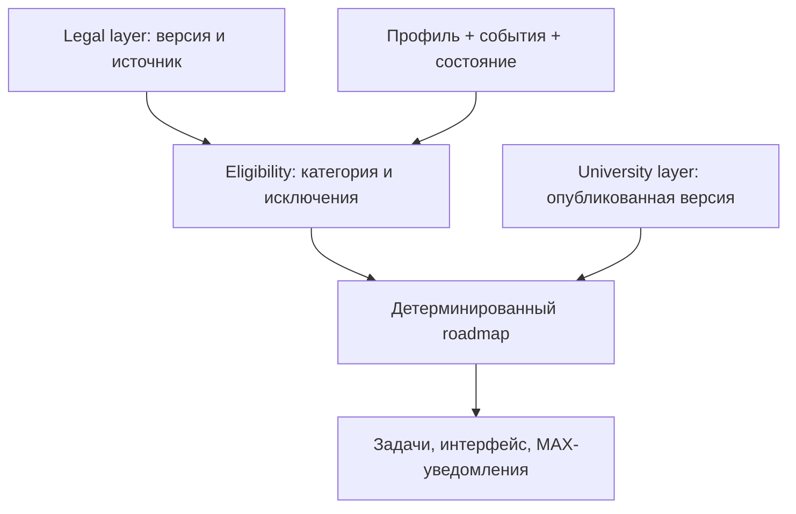

# MAX Foreign Students — финальный developer handoff

**Статус:** MASTER FINAL после независимой валидации 27.09.2026.  
**Срез решений:** 27.09.2026. **Цель:** собрать работающий MVP и комплект сдачи до **30.09.2026, 12:00 МСК**. Это спецификация реализации, а не индивидуальная юридическая консультация.

## 0. Как читать документ и разрешать конфликты

Приоритет источников по предмету:

1. **Продукт и границы MVP:** настоящий `max_foreign_students_developer_handoff_MASTER_FINAL_2026-09-27.md` — актуальный source of truth по продукту, scope и архитектурным инвариантам. Более ранние product/spec-файлы сохраняются только как provenance и история решений.
2. **Факты, применимость и сроки:** `foreign_students_rules_research_spbgutd_leti_2026.md` и перечисленные в нём первоисточники. Продуктовое решение о наличии функции не превращает неподтверждённый срок в факт.
3. **Хакатон и сдача:** приложенные официальный кейс «Забота о людях» (особенно с. 7, 9–10) и «Общий FAQ.pdf» (вопр. 1–3, 7, 10–19).
4. Предыдущие концепты, спецификации и аудиты — история решений и рисков; они не переопределяют настоящий FINAL handoff.

Далее `[F1]` и аналогичные коды ссылаются на реестр первоисточников в §19. Дата проверки исследования — **27.09.2026**. `P` — прямая официальная норма/действующая вузовская инструкция; `C` — официальное разъяснение или неполная проверка применимости; `U` — данных недостаточно. Хранить **отдельные** `norm_confidence`, `eligibility_confidence`, `formula_confidence`. При `unknown` не вычислять дату и не маркировать задачу как обязательную для этого человека.

## 1. Результат и границы MVP

Сервис в **MAX** превращает федеральные требования, местные процедуры двух вузов, профиль и события студента в **stateful персональный roadmap**. Он показывает несколько параллельных и будущих действий: что сделать, почему применимо, к какому сроку и кому передать документы; после смены обстоятельств или опубликованного изменения университетского правила изменяет только затронутые задачи, объясняет изменение и отправляет уместное MAX-уведомление.

В MVP: **СПбГУПТД и СПбГЭТУ «ЛЭТИ»**, 10 семейств задач (§6), структурированные события (§8), бот + student mini-app, **локальная админка вуза**, версионирование и affected-users пересчёт, RU/EN и ограниченный LLM language/event fallback. Это не 10 отдельных модулей: единая модель правила и задачи. Демо должно быть сквозным через MAX, интерфейс работоспособен в мобильной и веб-версии [CASE7]. Привязка mini-app к выданному боту производится организаторами по публичной HTTPS-ссылке [FAQ2–3]. Работающий бот остаётся доступен во время проверки [FAQ11].

**Роли:** `student`, `university_editor` с областью одного вуза, `maintainer` для защищённого правового слоя и демо-данных. Публикация университетского правила возможна уполномоченным редактором в собственном tenant; наличия настоящего соглашения с вузом пока не подтверждено. В тестовой среде роль сотрудника и данные являются **модельными**, так и обозначать на экране, в README и презентации [FAQ13,15].

## 2. Категории и границы автоматизации

| Ось | Автоматический маршрут при подтверждении | `needs_review` / безопасная ветка |
|---|---|---|
| Возраст, основание | Совершеннолетний, временно пребывающий с учебным основанием | Несовершеннолетний, РВПО/РВП/ВНЖ, неясное основание [F1,F7,S1]. |
| Въезд | Визовый или безвизовый, но **режим по конкретному гражданству/договору подтверждён** [F6] | Неизвестный договор, спорная цель въезда, переходный случай до 01.09.2026. |
| Вуз/площадка | Основной опубликованный порядок СПбГУПТД или ЛЭТИ | ВШТЭ и иная площадка с отдельной инструкцией [S2]; не наследовать без проверки. |
| Жильё | Общежитие или частный адрес; меняется принимающая сторона [F3,S1,E1] | Иное место/сложный гостиничный или стационарный случай без подтверждённого эффекта учёта. |
| Мед/биометрия | Ветка только после проверки цели, плана пребывания >90 дней, прежнего прохождения и исключений [F1,F2,F5] | Если не хватает пользовательского поля — `conditional`; если гражданство/исключение введено, но правовая применимость не подтверждена, либо есть конфликт/спорное начало отсчёта — `needs_review`. |
| Обучение | Стандартный активный учебный статус | Академический отпуск, перевод, отчисление, выпуск, работа и специальные программы требуют отдельной проверки [F1,F7]. |

Пользовательский «визовый/безвизовый» ответ помогает выбрать ветку, но **не заменяет** проверку гражданства и правового режима. Если для решения не хватает обычного пользовательского поля, используется `conditional` и запрашивается конкретное уточнение. `needs_review` используется, когда категория вне support envelope, правовая применимость после введённых данных всё ещё не подтверждена или источники конфликтуют: показать известную локальную инструкцию, источник и контакт, но не вычислять сомнительную федеральную дату. Визовый и безвизовый сценарии разделяет конфигурация eligibility, а не два независимых продукта.

### 2.1. Карта ветвлений и support envelope MVP

MVP **не реализуется как один линейный скрипт и не содержит заранее прошитого набора полных сценариев**. Roadmap компонуется из независимых применимых правил на основании профиля, подтверждённых событий и текущего состояния пользователя. Комбинации веток возникают динамически.

| Ось ветвления | Поддерживаемые варианты MVP | Поведение вне подтверждённой ветки |
|---|---|---|
| Вуз | СПбГУПТД / ЛЭТИ | Иной вуз — вне MVP. |
| Режим въезда | Визовый / безвизовый | Неизвестный режим — запрос уточнения, без предположений. |
| Гражданство и договор | Подтверждённая конкретная ветка | Гражданство/нужное поле ещё не введено → `conditional`; данные введены, но договорное исключение не подтверждено → `needs_review` / `eligibility=unknown`. |
| Жильё | Общежитие / частный адрес | Гостиница, стационар и иное место — только подтверждённые локальные действия, иначе `requires_recheck`. |
| Эпизод въезда | Первый въезд / повторный въезд | Новый эпизод пересчитывает только зависящие задачи; разовые выполненные процедуры не сбрасываются. |
| Медосмотр | Применим / не применим / применимость неизвестна; не пройден / пройден | При `unknown` нет рассчитанной юридической даты. |
| Биометрия | Требуется / уже пройдена / применимость неизвестна | Подтверждённая однократность сохраняется при повторном въезде. |
| Виза | Есть `visa_expiry` / визы нет | Визовые задачи не создаются без визовой ветки и anchor-date. |
| Миграционный учёт | Новый эпизод / подтверждён / требует перепроверки | После смены места старое подтверждение может стать `requires_recheck`, но не объявляется автоматически аннулированным. |
| События | `entry`, `reentry`, `address_changed`, `visa_issued`, `registration_confirmed`, `medical_completed`, `fingerprinting_completed`; гостиничные события осторожно | Сложное событие без проверенного ruleset → `needs_review`. |
| Специальный статус | Обычное временное пребывание с учебным основанием | РВПО/РВП/ВНЖ и иные специальные основания → `needs_review`. |
| Возраст | Совершеннолетний | Несовершеннолетний → `needs_review`. |
| Площадка | Основной порядок СПбГУПТД / ЛЭТИ | ВШТЭ и отдельные площадки → `needs_review`, пока не загружен отдельный adapter. |
| Учебный статус | Стандартное активное обучение | Академический отпуск, перевод, отчисление, выпуск, работа и сложные изменения статуса → `needs_review`. |

**Архитектурный инвариант:** не программировать отдельный сценарий вида «визовый студент СПбГУПТД + общежитие + уже пройдена биометрия + сменил адрес». Движок должен получить соответствующие факты и события и собрать итоговый roadmap из тех же rule records, которые используются для других комбинаций.

### 2.2. Единая семантика eligibility и engine status

| Ситуация | Eligibility/result | Engine status | Что видит пользователь |
|---|---|---|---|
| Все необходимые данные есть, правило применимо | `true` | `actionable` | Обычная задача; дата рассчитывается только если формула и применимость подтверждены. |
| Все необходимые данные есть, правило не применимо | `false` | не создавать активную задачу | Задача не показывается как обязательная; при необходимости решение остаётся в audit/history. |
| Не хватает **разрешимого пользовательского поля**: гражданства, даты, факта прохождения и т. п. | `unknown` | `conditional` | Условная карточка с запросом конкретного недостающего поля; юридическая дата не рассчитывается. |
| Категория находится **вне автоматического support envelope**, есть конфликт источников или требуется внешняя проверка | `unknown` или отдельная причина `unsupported/review_required` | `needs_review` | Известная инструкция/контакт/источник и объяснение, что автоматический расчёт не выполняется. |
| Ранее актуальная задача заменена новым эпизодом/версией | — | `superseded` | Старое выполнение и история сохраняются; новая актуальная задача существует отдельно. |
| После события старое подтверждение может больше не соответствовать обстоятельствам | — | `requires_recheck` | Карточка «нужно проверить повторно» без утверждения, что прежний документ юридически аннулирован. |

`unknown` — это результат недостатка знания/данных, **не отдельный пользовательский статус задачи**. Он должен быть преобразован в `conditional` или `needs_review` по таблице выше. Пользовательские `not_started / in_progress / completed` хранятся независимо от engine status.

## 3. Архитектура и порядок расчёта



Один backend может содержать компоненты `legal catalog`, `eligibility evaluator`, `event reducer`, `rule evaluator`, `roadmap diff`, `notification outbox`, `university admin`. Не нужен отдельный микросервис на каждый компонент. Движок получает **временной срез** профиля, подтверждённых событий и опубликованных версий; выдаёт задачи с объяснимыми основаниями. Правила федерации, договора/гражданства и университета версионируются независимо. Правила вуза не могут переопределить eligibility федеральной процедуры или заменить `legal_deadline` своим сроком.

Рекомендуемый контракт функции (псевдотип):

```text
buildRoadmap(profile, confirmedEvents, legalRulesAt(t),
             universityRulesAt(t), now, calendarRU)
  -> { tasks[], eligibilityDecisions[], warnings[], appliedVersions[] }
```

`unknown` в трёхзначной логике `true/false/unknown` **не равно true**. Публикация локального правила и событие пользователя инициируют детерминированный пересчёт; результат diff по стабильному `task_key = user_id + rule_id + episode_id + cycle_id`. Повторная доставка event/webhook и повторный запуск не создают дублей. Помимо технического `task_key`, движок использует `semantic_action_key` для защиты от смысловых дублей, когда разные rules описывают одно и то же действие в одном `episode_id`; это особенно важно для M09 против M03/M04. Закрытая задача сохраняет историю и версию, изменённая задача — старые и новые значения с причиной. `superseded` означает новый эпизод, `requires_recheck` — старое подтверждение может не соответствовать новым обстоятельствам; не объявлять федеральное аннулирование без основания.

## 4. Правила и четыре типа времени

| Поле | Смысл, кто владелец и как отображать |
|---|---|
| `legal_deadline` | Государственный нормативный срок только при доказанной норме **и персональной применимости**. `owner=state`; источник, действующая редакция, начало и единица обязательны. |
| `university_submission_deadline` | Срок для обращения/передачи документов **вузу**, возможен раньше истечения документа. `owner=university`; локально обязательный или рекомендованный характер фиксируется отдельно, не угадывается. |
| `preparation_start` | Когда начать собирать документы: `owner=university` при опубликованном совете или `owner=product` для явно помеченного UX-буфера. Самостоятельные числовые буферы продукта до настройки не добавлять. |
| `document_expiry` | Факт об окончании конкретной визы, регистрации, разрешённого пребывания или полиса, введённый/подтверждённый пользователем. Это **не** срок подачи. |

Каждый temporal value: `{kind, owner, required_or_recommended, anchor_field, formula_or_literal, unit: calendar|working|hours|unspecified, timezone, computed_at|null, source_url, checked_at, uncertainty, rule_version}`. Хранить `visa_expiry`, `registration_expiry`, `stay_expiry` раздельно. Для `working` нужен официальный календарь выходных/праздников на соответствующий год; для `unspecified` формула остаётся текстом, дата `null`. Для «в первые 24 часа» требуется точное время события, для выходного исключения — рабочий график вуза. Дни федерального права и переходные положения дополнительно сверить до релиза персонального калькулятора [F1–F3].

Пример: СПбГУПТД `visa_expiry - 60 calendar days` — **рекомендуемый вузом локальный срок обращения** (`required_or_recommended=recommended_by_university`), не федеральный дедлайн и не само истечение визы [S1]. Рекомендательный характер следует из опубликованного заголовка СПбГУПТД «Рекомендуемые сроки обращения»; это не отменяет обязательность самой процедуры продления, если она применима. ЛЭТИ «не позже чем за 45 дней» — опубликованная локальная формулировка с `unit=unspecified`; никакого `expiry - 45 calendar days` до ответа офиса [E1]. Фраза СПбГУПТД «в течение 2 дней» также остаётся буквальной до уточнения единицы [S1].

## 5. Минимальный каталог источников и допустимости

Все правила ниже ссылаются на §19. `P/C/U` указывают доступное доказательство **на дату исследования**, а не юридическую гарантию. Для каждого rule record хранить версию и прямую ссылку. Старые страницы ВШТЭ не используют как актуальный общий срок медицинского осмотра: после №162-ФЗ разъяснён 30-дневный период для подпадающих категорий с 01.09.2026 [F1,F2,S2]. Предъявленный в source research общий срок учёта 7 **рабочих** дней [F3] нельзя считать для каждого студента без договорного и адресного исключения. Законный срок и локальное обращение могут существовать одновременно.

## 6. Десять семейств задач MVP — спецификация rule catalog

Общее: `trigger` создаёт **кандидат**; eligibility проверяет поля и исключения; `false` подавляет активную задачу, а `unknown` преобразуется в `conditional` или `needs_review` строго по §2.2 и не получает вычисленную юридическую дату. В таблице документы — опубликованный минимум; `уточнить` запрещает выдавать придуманный исчерпывающий список. При повторном событии создаётся новый `episode_id`, если указано, а завершённые статусы разовых процедур не сбрасываются. Статусы норм/применимости/формулы — в отдельных колонках данных.

| ID / действие | Применимость; trigger → время | Студент, документы, адресат | Источник и неопределённость |
|---|---|---|---|
| **M01 До въезда / приглашение** | Визовая ветка до въезда: проверить режим, основание, приглашение и визу; безвизовый студент СПбГУПТД очной/очно-заочной формы согласует дату прибытия. `planned_entry/education_start`. Для СПбГУПТД обратиться за приглашением **примерно за 60 календарных дней до занятий** (`preparation_start`, совет вуза); федеральной вычислимой даты нет. | СПбГУПТД: анкета, копия паспорта с указанным вузом сроком действия; отдел виз через приёмное/международное подразделение, запрос лично/e-mail, затем консульство. ЛЭТИ: опубликованная страница «до приезда», конкретный набор по категории сверить; не копировать пакет СПбГУПТД. | [F6,S1,E2]. Норма C, персональный договор U до проверки; СПбГУПТД локально P. |
| **M02 Въезд и миграционная карта** | Визовый/безвизовый студент; `entry_recorded`/`reentry_recorded` с фактической датой, целью и документом. Собственного срока в приложении нет; событие — якорь M03–M06. При новом въезде заново проверить карту/учёт, не сбрасывать однократную биометрию. | На границе паспорт, миграционная карта при применимости; СПбГУПТД требует цель «учёба» и предупреждает о невозможности учебного продления при иной цели по своей инструкции. При несоответствии — контакт офиса, не обещать исправление. | [F6,S1,E1]. Правило C, исключения карты U. |
| **M03 Обратиться в офис после приезда** | Факт прибытия + вуз. СПбГУПТД **«в течение 2 дней после въезда»**, `unit=unspecified`, `university_submission_deadline` текстом. ЛЭТИ **в первые 24 часа после прибытия в Петербург**, выходной — первый рабочий день; точный timestamp/расписание нужны для даты. Повторный въезд снова открывает локальное действие. | СПбГУПТД: оригинал паспорта + 3 копии заполненных страниц, карта + 3, документ об учёбе + 2, нотариальный перевод + 1; копии после въезда. Отдел регистраций и виз, Большая Морская, 18, каб. 437А, inter@sutd.ru. ЛЭТИ: паспорт/копия, карта/копия, виза при наличии, документ об учёбе по курсу; ул. Профессора Попова, 5, корп. 3, каб. 3423-1. | [S1,E1] локально P; точная формула СПбГУПТД U, исключение графика ЛЭТИ требует расписания. Не выдавать локальный срок за 7W закона. |
| **M04 Учёт по фактическому месту** | `entry_recorded`, `reentry_recorded`, `address_changed`, `hotel_stay_*`; общежитие/частный адрес различаются. Общая база уведомления **7 рабочих дней после прибытия в место** только при проверенных договоре, принимающей стороне и исключениях; по умолчанию `legal_deadline=null`. Новый адрес — новый эпизод, старое подтверждение `requires_recheck`. | Общежитие: оформление через соответствующий офис. СПбГУПТД частный адрес — оформить с собственником и передать скан обеих сторон регистрации вместе с пакетом M03; ЛЭТИ частный адрес — оформление по фактическому адресу, отправить новое уведомление на 2343553@mail.ru. Для гостиницы — проверить оформление принимающей организацией и сообщение вузу, не универсализировать эффект. | [F3,S1,E1]. Общая норма C, конкретная formula/eligibility U до договора и места; локальные маршруты P. Онлайн-подача возможна лишь при допустимом заявителе и способе [F3], не обещать студенту универсально. |
| **M05 Медицинское освидетельствование после въезда** | Только если подтверждена применимость неработающего пребывания >90 дней либо иного законного основания и отсутствует исключение; `entry_recorded`, действующая редакция с **01.09.2026**. Для подпадающего лица исследование указывает **30 календарных дней со въезда** (`legal_deadline`, после проверки индивидуальной ветки и способа отсчёта). | Обратиться в уполномоченную медицинскую организацию; вузовское место/пакет уточнять, ЛЭТИ указывает здравпункт и офис, отдельную общежитскую флюорографию не смешивать с этой процедурой. Хранить лишь факт/дату, не диагноз или заключение. | [F1,F2,F4,E2,S1]. Норма P/C, применимость C/U; переходные случаи и освобождение Беларуси по ЛЭТИ проверить. При `unknown` текстовая карточка без `computed_at`. |
| **M06 Дактилоскопия и фотографирование** | Для соответствующей категории нерабочего пребывания >90 дней, если ранее не выполнено; `entry_recorded`; исследованный срок **90 календарных дней со въезда**, однократно. `fingerprinting_completed` закрывает, повторный въезд не открывает заново при подтверждении выполнения. | Студент → компетентное подразделение МВД; паспорт/миграционные документы и точный пакет уточнить. СПбГУПТД помечает процедуру однократной, для несовершеннолетних требуется представитель (эта категория вне автоматического MVP); локальный подробный порядок ЛЭТИ не найден. | [F5,S1]. Норма C, применимость/исключения C/U, адрес ЛЭТИ U. Не подменять 90D старым медицинским сроком. |
| **M07 Заблаговременная подача на визу** | Только действующая визовая ветка и `visa_expiry`; после `visa_issued` новый цикл. СПбГУПТД: `university_submission_deadline` — **рекомендуемый вузом срок обращения за 60 календарных дней до конца визы** = `visa_expiry - 60D`; `required_or_recommended=recommended_by_university` [S1]. ЛЭТИ: **не позже чем за 45 дней** до конца визы, `unit=unspecified`, конкретная дата `null` до проверки. `document_expiry=visa_expiry` отдельно. | Студент передаёт действующую визу, паспорт, подтверждение учёбы и локальный пакет в свой офис; точный исчерпывающий набор уточнить. СПбГУПТД каб. 437А; ЛЭТИ каб. 3423-1. Решение по визе — компетентный орган, отметка студента «передал в вуз» не равна «получил визу». | [F1,F6,S1,E1]. Локальная формулировка P, федеральной универсальной даты подачи здесь нет; для ЛЭТИ формула U. |
| **M08 Подготовка продления учёта / пребывания** | Раздельные `registration_expiry` и `stay_expiry`, действующая категория. СПбГУПТД рекомендует **за 50 календарных дней** для регистрации **по общежитию**; опубликованный перечень также упоминает миграционную карту и срок пребывания для граждан Беларуси, их область применения уточнить. ЛЭТИ — текст «не позже чем за 45 дней до окончания визы/регистрации», unit U. Новый подтверждённый документ запускает новый цикл. | Студент обращается в тот же офис, по своему виду жилья/основания; паспорт, карта, уведомление, документы об учёбе по ветке, полный пакет уточнить. Частный адрес СПбГУПТД **не получает 50D автоматически по аналогии**. | [F1,F3,S1,E1]. Дата 50D P только при подтверждённой регистрации по общежитию; остальная применимость U. Не сливать M07 и M08. |
| **M09 Изменение маршрута после событий / orchestration** | `reentry_recorded`, `address_changed`, `hotel_stay_started/ended`, `registration_confirmed`, `visa_issued`. M09 — **оркестратор эпизодных последствий**, а не дополнительная копия M03/M04/M07/M08 и не новый универсальный федеральный срок. Он инициирует пересчёт зависимых семейств и создаёт отдельную карточку только для уникального локального follow-up, которого ещё нет среди M03/M04/M07/M08. Для дедупликации использовать `semantic_action_key` вместе с `episode_id`; одинаковое действие из двух rules не должно давать две карточки/два напоминания. | СПбГУПТД после границы, гостиницы/больницы, переезда, нового паспорта/статуса велит обратиться в отдел **«в течение 2 дней»** (без числовой даты до уточнения). Если это действие уже представлено M03 для того же эпизода, M09 не создаёт дубль. ЛЭТИ требует повторный маршрут учёта, поездки по РФ согласовать; в указанной категории зарубежной поездки заявление за **3 рабочих дня до выезда** в каб. 3418 — это пример отдельного уникального follow-up при подтверждённой применимости. | [F3,S1,E1]. Локальные тексты P, федеральный эффект гостиницы/старой регистрации U; сложный паспорт/статус → `needs_review`. |
| **M10 Повторный медицинский цикл** | Для подтверждённо подпадающей категории с известной `last_medical_completed_at`: после **одного года со дня предыдущего обследования** пройти в пределах следующего **30-дневного календарного окна**. `medical_completed` закрывает текущий и запускает следующий цикл; без предыдущей даты не вычислять. | Студент → уполномоченная медорганизация, локально ЛЭТИ → здравпункт/офис по инструкции; точный пакет уточнить, не хранить результат анализа. Отображать начало и конец окна отдельно. | [F1,F2,E2,S1]. Разъяснение C, формула на границе года/29 февраля и переходные случаи U до проверки. |

**Комплекты и контакты не универсальны.** Для M04–M10, где вуз не публикует полный пакет, UI показывает «уточните в офисе» и ссылку, а не дублирует список M03. Документы для заселения, полис ДМС, признание образования, работа и специальный статус находятся вне автоматического набора (§18), хотя можно дать информационную ссылку [S1,S2,E2,F7].

## 7. University adapter: подтверждённые различия

| Операция | СПбГУПТД [S1] | ЛЭТИ [E1,E2] | Общий core |
|---|---|---|---|
| Въезд | Согласовать до въезда для указанной безвизовой категории; цель «учёба»; офис после въезда в течение 2 дней, единица не названа | По приезде в первые 24 часа, выходной — первый рабочий день | `entry episode`, вузовское действие и источник; разные часы/комплекты. |
| Учёт | Общежитие через отдел; частный адрес с собственником и сканом подтверждения | Общежитие через офис; частный адрес и отправка уведомления на e-mail | Один тип задачи, adapter `residence_type`, локальные каналы. |
| Виза | Рекомендуемый вузом срок обращения −60 календарных дней, каб. 437А [S1] | «Не позже −45 дней», единица неизвестна, каб. 3423-1 | `visa_expiry` отдельно; для ЛЭТИ запрет вычисления срока при `unit=unspecified`; характер каждого локального срока хранить отдельно. |
| Регистрация | −50 календарных дней **для регистрации по общежитию**; остальные объекты 50D уточнять | «−45 дней» для регистрации, единица неизвестна | `registration_expiry` и `stay_expiry` отдельно. |
| Медицина | Ежегодные сертификаты в списке; операционный адрес/пакет уточнить | Медстраница с актуальным законом, здравпункт/офис, оговорка о Беларуси | Федеральная eligibility/временная версия общие, local action различается. |
| События | После перечисленных событий обратиться в течение 2 дней | Поездки/гостиница/новое место требуют локальных действий, поездка за рубеж в применимом случае −3 рабочих дня | Event reducer общий, правовой эффект только с источником. |

Контакты: СПбГУПТД — Отдел регистраций и виз, **Большая Морская, 18, каб. 437А**, **inter@sutd.ru** [S1]. ЛЭТИ — Международный студенческий офис / офис виз и регистраций, **ул. Профессора Попова, 5, корп. 3, каб. 3423-1**; **2343553@mail.ru** опубликован для отправки новой регистрации при частном адресе; не считать его доказанным универсальным каналом всех вопросов [E1]. По зарубежным поездкам страница указывает каб. 3418 [E1]. Подключение ВШТЭ не включено автоматически: отдельные 45-дневные/старые 90-дневные тексты [S2] требуют разбирательства.

## 8. События, состояние и влияние на roadmap

| Event, обязательный payload | Создать / пересчитать | Закрыть / проверить; уведомление |
|---|---|---|
| `entry_recorded`: дата/время, цель, режим, жильё | Закрыть до-въездную фазу M01; M02, M03, M04, условно M05/M06, M07/08 при известных expiry | Сгенерировать diff; сообщить о нескольких новых задачах; не применять спорный федеральный срок. |
| `reentry_recorded`: дата, карта/цель, жильё | Новый эпизод M02–M04 и M09; проверить M05 по прежней дате | Уже выполненную M06 не возобновлять; прежний учёт `requires_recheck`. |
| `address_changed`: дата, из/в `dorm\|private\|other`, новое место без обязательного точного адреса | Новая ветка M04/M09, другой комплект/канал; при подтверждённой регистрации новый expiry M08 | Старую задачу учёта `requires_recheck`/`superseded` после подтверждения; уведомить о новом действии. |
| `hotel_stay_started` / `hotel_stay_ended`: даты и тип места | Проверка принимающей стороны и действий по возвращении M09 | Не объявлять старый учёт аннулированным как универсальный правовой факт; показать офис. |
| `visa_issued`: новая `visa_expiry`, тип, дата, `verification=user_attested|office_verified` | Следующий цикл M07, изменение приоритета; при необходимости проверить учёт M08 | В MVP событие обычно `user_attested`: пользователь сообщает факт нового документа. `office_verified` допустим только при реальном основании; не выдавать self-report за подтверждение госоргана. |
| `registration_confirmed`: место, дата, `registration_expiry`, `verification=user_attested|office_verified` | Закрыть текущий эпизод M04, открыть M08 | В MVP по умолчанию `user_attested`; при смене места проверить соответствие и предыдущие задачи. Название события не означает внешнюю государственную верификацию. |
| `medical_completed`: дата | Закрыть M05/M10, поставить следующий M10 после года | Только факт, не медицинский результат; не создавать дубль. |
| `fingerprinting_completed`: факт/дата | Закрыть M06 | Сохранить однократность при повторном въезде. |
| `passport_replaced`, `status_changed`, `enrolment_changed`: тип, дата | `needs_review`, запрос офису; инвалидировать лишь зависящие от неизвестных полей вычисления | Не пересчитывать сложную категорию как будто новый статус подтверждён системой. |

Пользовательский ввод через кнопки и формы — основной путь. Свободный текст → LLM возвращает `candidate_event {type, fields, confidence}` → сервер валидирует enum/поля и показывает человеку точную интерпретацию `[Подтвердить] [Изменить]`; **только подтверждение** пишет событие и вызывает пересчёт. Для даты в естественном языке сохранять исходный текст, после явного выбора календарной даты удалять лишнее. Ошибка разбора даёт форму ручного события, не молчаливое изменение плана.

**Исправление ошибочного события:** записанное событие не переписывать задним числом без истории. Пользователь может выбрать «Исправить» или «Отменить событие»; backend создаёт корректирующую запись (`supersedes_event_id`) либо помечает исходное событие `retracted_at`, сохраняет audit trail и детерминированно пересчитывает roadmap. Задачи, возникшие только из отменённого события, становятся `superseded`/исчезают из активного плана по diff, а независимые задачи не меняются. Уведомление отправляется только при реальном изменении roadmap.

## 9. Данные и границы API/состояния

Рекомендуемые сущности; имена полей — контракт реализации, допускается переименование при сохранении смысла:

| Entity | Основные поля и инварианты |
|---|---|
| `UserProfile` | `id`, `max_user_id`, `university_id`, `campus_id\|null`, `language`, `age_band`, `citizenship\|null`, `visa_regime\|unknown`, `migration_basis\|unknown`, `study_status`, `programme/form\|null`, `stay_over_90_days\|unknown`, `residence_type\|unknown`, `entry_at\|null`, `entry_purpose\|null`, `visa_expiry\|null`, `registration_expiry\|null`, `stay_expiry\|null`, `last_medical_completed_at\|null`, `fingerprinting_completed\|unknown`, `consent/updated_at`. Гражданство и режим не отождествлять. |
| `SourceEvidence` | `id`, `source_type=public_official/employee_confirmed/demo_model`, `official_url` либо идентификатор внутреннего основания, `title`, `authority`, `checked_at`, `published_at\|null`, `valid_from/to\|null`, `excerpt_or_locator`, `confidence`, `notes`. Хранить основание и дату проверки в snapshot задачи; внутреннее подтверждение не выдавать за опубликованный НПА. |
| `RuleVersion` | `rule_id`, `version`, `layer=legal\|university\|product`, `owner_id`, `university_id\|null`, `status=draft\|validated\|published\|archived`, `effective_from/to`, `eligibility_predicate`, `trigger_types`, `action_i18n`, `documents`, `contact`, `deadline_specs[]`, `source_evidence_ids[]`, `norm/eligibility/formula_confidence`, `uncertainty`, `created_by`, `published_at`. Опубликованная версия immutable. |
| `Event` | `id`, `user_id`, `type`, `occurred_at`, `recorded_at`, `payload`, `source=user\|admin\|fixture`, `user_confirmation_status`, `verification=user_attested\|office_verified\|external_verified`, `idempotency_key`, `episode_id`, `schema_version`, `supersedes_event_id\|null`, `retracted_at\|null`. `candidate` отдельно от записанного события. `office_verified/external_verified` использовать только при реальном проверяемом основании; обычный клик студента — `user_attested`. |
| `Task` | `task_key`, `user_id`, `rule_id/version`, `episode_id`, `cycle_id`, `title/action`, `eligibility_decision/reason`, 4 разных дат/метаданных, `user_status`, `engine_status`, `priority_bucket`, `documents/contact/source_snapshot`, `last_changed_reason`, `created/updated_at`. `completed_at` не терять при пересчёте. |
| `TaskHistory/RoadmapRevision` | До/после по изменённым полям, `trigger_event_id\|rule_publication_id`, `applied_legal/university_version`, timestamp, `notified_at\|null`; объяснение «что изменилось». |
| `AdminPublication` | Автор/роль/tenant, draft_version, validation_result, preview_profile, `affected_count`, confirmation, publication time, change label `official\|demo_model`, job/outbox status. |
| `NotificationOutbox` | `user_id`, `reason`, `task/revision_id`, `template/locale`, `dedupe_key`, `send_status`, attempts; не посылать текст с диагнозом/паспортом. |

Защита: аутентифицировать MAX launch data **на сервере** и привязывать профиль к проверенному MAX user ID; непроверенные клиентские поля не являются авторизацией. Проверить подпись и срок данных запуска по [документации MAX](https://dev.max.ru/docs/webapps/validation). Backend отдельно проверяет роль/tenant на каждом admin endpoint; редактор СПбГУПТД не видит и не меняет ЛЭТИ, студент не публикует rule. Продуктовый backend HTTP(S) — собственный API конкурса (§17), его контракт документировать.

## 10. Progressive onboarding и student UI

Первый проход: **язык → вуз → визовый/безвизовый режим → планируемая или фактическая дата въезда → общежитие/частный адрес → дата окончания визы, если визовая и известна → первый roadmap**. Перед персональным выводом юридических сроков запросить возрастную/статусную ветку, гражданство и план >90 дней либо оставить M05/M06 `conditional`. `Не знаю` — допустимый ответ; нельзя заставлять пользователя угадывать. Позднее, по нужде конкретной задачи, спросить дату прошлого медосмотра, выполнение биометрии, дату регистрации, учебную программу/форму, точное время прибытия для 24h.

Экран студента: **Сейчас / Скоро / Позже / История**. Карточка кратко: действие, практический срок или «уточнить», статус, когда начать подготовку; раскрытие: почему относится ко мне, четыре отдельные даты с владельцем и типом, документы, офис/канал, источник/дата проверки, история изменений. Статус загрузки, результат действия, ошибка и восстановление без сброса пути обязательны (кейс, критерии UX/UI и стабильности, с. 12–13). Не скрывать условную задачу из-за недостающего поля и не показывать её как установленную обязанность. Отдельная кнопка «Я сменил адрес» и видимое изменение задач; в истории — «до/после».

Пользовательские статусы: `not_started`, `in_progress`, `completed`. Движковые: `conditional`, `actionable`, `requires_recheck`, `superseded`, `needs_review`; `unknown` хранится как результат eligibility/неопределённость и маппится в engine status по §2.2. Они независимы: например, ранее `completed` регистрация может стать `requires_recheck` после адреса, сохранив факт прежнего выполнения; UI говорит «Проверьте учёт по новому адресу». `completed` вручную для передачи в вуз не равно подтверждённому результату госоргана. Приоритет `Сейчас/Скоро/Позже` — конфигурируемая **продуктовая сортировка** по реальным датам и отсутствию даты, без выдумывания обязательного дедлайна.

## 11. Админка вуза: обязательный MVP, но ограниченная роль

Редактор видит только локальные правила своего вуза, создаёт новое, правит срок/документы/контакт/кабинет, архивирует, смотрит preview на тестовом профиле, число затронутых пользователей и публикует новую версию. Workflow `Draft → Validated → Published → Archived`; откат — новая явно опубликованная версия, а не изменение старой. Федеральная норма, договорное исключение и `legal_deadline` недоступны для локальной правки. Не делать CRM, чат или массовую произвольную рассылку.

Форма срока принимает **тип и формулу**, например `anchor=visa_expiry`, `offset=-60`, `unit=calendar`; `departure_at - 3 working days`; допускает абсолютную дату для разовой кампании. Для неизвестной единицы из публичной страницы ЛЭТИ форма сохраняет `unspecified` и текст, не предлагает публикацию вычисляемого срока. Поля: категория/предикат, trigger, действие, документы, контакт, source URL или утверждённое внутреннее основание, `checked_at`, срок, владелец, статус обязательности/рекомендации. Нельзя редактировать одну календарную дату у каждого студента вместо общей формулы без явного разового правила.

Валидация перед `Published`: требуемые поля; правильный anchor/unit и допустимая формула; `effective_from`; отсутствие противоречия защищённому слою; симуляция на применимом и неприменимом профилях; preview diff и affected count; явное подтверждение редактора. `Validated` значит **структурно и логически проверено + подтверждено редактором**, а не юридически удостоверено. Система не должна позволять из одного admin-поля доказать новую федеральную обязанность. Если локальный срок подтверждён сотрудником, хранить кто/когда/на каком основании; маркировать `employee_confirmed` отдельно от `public_official_source`.

**Demo change:** используйте отдельное модельное правило/tenant или изолированный демо-профиль с меткой **«Демонстрационное изменение университетского правила»** в форме, карточке, уведомлении и материалах. Не менять публичную инструкцию настоящего вуза на произвольную дату и не утверждать реальное участие сотрудника. Это совместимо с требованием финальной спецификации показать публикацию и пересчёт [FAQ13,15].

## 12. Публикация, affected users, повторяемость

В одной транзакции: проверить версию draft и роль → зафиксировать immutable `Published` и архивировать предыдущую для новых расчётов → записать `AdminPublication` и задание перерасчёта. Определить кандидатов по `university_id`, затронутому `rule_id`, предикату и полям anchor; **для надёжности MVP** допустим перебор всех активных профилей вуза с применением нового правила, затем diff. Указать точный `affected_count` до подтверждения и фактический после. Не уведомлять тех, у кого roadmap не изменился.

Для каждого пользователя пересчитать атомарно snapshot и `RoadmapRevision`; не сбрасывать пользовательский статус, если смысл/эпизод действия не изменился; если правило стало неприменимым, пометить прежнюю задачу `superseded` и объяснить. Outbox-процесс отправляет ровно одно логическое уведомление по `dedupe_key=publication_id:user_id:revision_id`, с retry и статусом отправки. Ошибка MAX не откатывает опубликованное правило или план: студент увидит обновление при повторном открытии, а уведомление можно повторить. Идемпотентные операции нужны и для user events. Seed/reset допустимы как внутренний инструмент автоматизированных тестов и восстановления модельных admin-данных; пользовательский demo не должен использовать скрытый предзаполненный профиль или обход onboarding.

## 13. MAX notifications

Три триггера: персональное изменение после события, опубликованное изменение локального правила с **реальным diff**, начало подготовки к подтверждённому сроку. Отправлять через выданного бота MAX, со ссылкой/deep link на соответствующую карточку, без sensitive payload. Уведомление содержит **что поменялось**, кто владелец срока, и путь «открыть план»; для неопределённого срока — «уточните в офисе», не «срочно до завтра». Предусмотреть дедупликацию, часовой пояс пользователя или явно МСК, настройку/отключение reminders и шаблоны RU/EN. Работающий путь бот → mini-app → задача → событие → уведомление проверить внутри MAX, не только локально [CASE7, FAQ2–3,11].

## 14. Языки и LLM

RU и EN — **человеком проверенные** строки критических действий, сроков, документов и состояний. Для иных языков можно переводить **только пояснение** из уже отобранной проверенной карточки; `rule_id`, applicability, даты, числовые величины, документы, офис/контакт, источник и uncertainty вставляются из структурированных полей **после** перевода. Отображать исходный русский текст/ссылку, fallback к RU/EN при ошибке или низком доверии. Не позиционировать произвольные языки как полностью юридически проверенные.

LLM может определить язык, упростить объяснение, подсказать навигацию, извлечь `candidate_event` и отвечать по проверенным карточкам с цитированием. Она **не создаёт нормативное правило, не решает юридическую применимость, не выдаёт неподтверждённый документ/срок, не меняет roadmap**. Сервер ограничивает модель JSON-схемой allowed events и не принимает её ответ как подтверждённый факт. Ответ по базе при недостающем источнике: сообщить неопределённость и контакт. Отключение LLM не ломает кнопочный основной сценарий.

## 15. End-to-end demo и ручная проверка

Основной demo проходит через **обычный пользовательский onboarding**. Никакого специального `demo user`, скрытого предзаполненного профиля, хардкода roadmap или shortcut, который пропускает заполнение данных, быть не должно. Ведущий вручную вводит тестовые значения через те же формы, что использует реальный студент; roadmap рассчитывается тем же rules engine. При одинаковых входных данных результат должен быть одинаковым, при изменении входных данных — меняться в соответствии с применимыми правилами.

Для презентации и README можно указать **recommended test inputs**, чтобы проверяющий быстро попал в насыщенную ветку: СПбГУПТД, совершеннолетний временно пребывающий визовый студент, учебная цель, план пребывания >90 дней, общежитие, известная дата въезда и известная дата окончания визы, медосмотр и биометрия ещё не отмечены как выполненные. Это только инструкция для ручного ввода, а не fixture продукта. Конкретное гражданство использовать для вычислимых федеральных сроков только после проверки соответствующей eligibility-ветки; иначе M05/M06 остаются условными без рассчитанной юридической даты.

| Шаг | Действие и проверяемый результат |
|---|---|
| 1 | Открыть выданного бота в MAX и пройти обычный progressive onboarding: язык → вуз → режим → необходимые данные о въезде/жилье/документах. Сервер валидирует launch data. |
| 2 | После onboarding mini-app динамически строит несколько задач одновременно в зависимости от введённых данных; видны действие, срок или `уточнить`, документы/офис/источник, тип срока и статус. |
| 3 | Открыть одну задачу с локальным вузовским сроком, поставить `in_progress`, закрыть и повторно открыть приложение: состояние сохранено. |
| 4 | Через обычное пользовательское действие сообщить `address_changed: dorm → private`; M04/M09 пересчитываются, прежний учёт получает `requires_recheck`, появляется порядок для частного адреса и история изменения. |
| 5 | Демо-редактор СПбГУПТД в отдельной админке создаёт или меняет **явно модельную** локальную rule-version; проходит validation, preview, affected count и подтверждает публикацию. |
| 6 | Система пересчитывает только затронутые roadmap, сохраняет diff/history; студент получает **настоящее** MAX-уведомление «маршрут обновлён» с пометкой демонстрационного изменения и открывает изменённую карточку. |
| 7 | Для проверки второго adapter повторить обычный onboarding в отдельной тестовой сессии/аккаунте для ЛЭТИ или дать жюри сделать это самостоятельно: тот же core должен выдать другой локальный порядок, контакты и сроки. Специальной hardcoded demo-логики для ЛЭТИ нет. |

Главный критерий demo: жюри должно видеть причинно-следственную связь **введённые данные → применимые правила → roadmap → событие → пересчёт → публикация вузовского правила → affected diff → MAX-уведомление**. Предзаполненные данные допустимы только во внутренних автоматизированных тестах, но не как замена пользовательскому onboarding в живом сценарии. **Нельзя** подменять rules engine захардкоженным roadmap, живое MAX-сообщение скриншотом или модельную администрацию реальным партнёрством с вузом.

## 16. Privacy, безопасность и эксплуатация

Минимум данных: `MAX ID`, вуз, гражданство/правовой режим, ключевые даты, тип жилья, статусы процедур и задач, события для объяснения изменений, язык. Не хранить паспортные номера/сканы, точный адрес без необходимости, диагнозы, результаты осмотров, изображения документов. Если UI показывает список документов, это инструкция, а не запрос их загрузить. Отдельно реализовать удаление профиля/минимальные сроки хранения, исключить эти данные из логов и LLM prompt, не отправлять в MAX-уведомления. Демоданные полностью синтетические. Разграничение student/tenant editor/maintainer, проверка MAX identity, секреты через окружение, в репозитории только `.env.example` [CASE7, CASE9].

Выполненное студентом действие и большинство событий документов в MVP — `user_attested` self-report. Не утверждать, что вуз или ведомство подтвердили/выдали документ без реального основания или интеграции; внешних реальных интеграций с МВД/ЕСИА и внутренними вузовскими системами нет. Приложение объясняет источник и открытые ограничения. Ошибка источника/неизвестная категория не должна приводить к ложной срочности.

## 17. Требования хакатона и чек-лист сдачи

| Артефакт/условие | Что подготовить; основание |
|---|---|
| Работающее решение | Выданный MAX-бот, доступный основной сценарий в мобильной и веб-версии; mini-app, если используется, на публичном HTTPS и привязан организаторами через форму из [FAQ2](https://sbor-ssylok-dlya-mini-prilojeniy.testograf.ru/); работа после сдачи на период проверки [CASE7, FAQ1–3,11]. |
| Зафиксированный код | Git с commit hash **или** архив с контрольной суммой; версия после срока не изменяется. Если приватный repo, архив — надёжный путь, ссылку дать дополнительно [CASE9, FAQ18]. |
| Docker | Dockerfile нужных компонентов, `compose.yaml`/`docker-compose.yml` одной командой, `.dockerignore`, `.env.example` без секретов; файл фиксированных зависимостей; сборка **≤5 минут** без первичной загрузки базовых образов [CASE9, FAQ7]. |
| README | Назначение, основной сценарий, архитектура, команда Docker, параметры/порты/зависимости/окружение, интеграции и данные, технические seed/test fixtures и тестовые роли, шаги/ожидаемый результат, ограничения, остановка и повторный запуск; что реально подключено, что модельно [CASE9, FAQ13,15]. |
| PDF презентация | Первый **служебный** слайд: бот, repo/hash, API при наличии, тестовые учётные записи, необходимые для проверки параметры/секреты и краткий сценарий. Дальше проблема, решение, эффект, архитектура, источники, масштабирование, ограничения. Передать секреты только в предусмотренном канале организаторов, **не** коммитить в repo и не публиковать в общедоступной версии PDF [CASE7, CASE10]. |
| Собственный API | Если backend предоставляет продуктовые HTTP(S)-методы (профиль, roadmap, события, админка), это **собственный API** [FAQ12]. Нужны доступный HTTPS-адрес, `openapi.yaml/json` версии 3.0/3.1, тестовые роли и данные, `DATA-API.yaml` с версией схемы, именем решения, base URL, обязательными проверками метода/пути/параметров/роли/status codes/формата обязательных полей [CASE10]. Не ухудшать архитектуру ради обхода. В FAQ чисто служебный webhook отдельно не классифицирован — при сомнении уточнить организаторов. |
| Срок и площадка | Передать в личном кабинете **до 30 сентября 12:00 МСК**; поздние изменения зафиксированного кода/презентации не попадут в онлайн-этап [FAQ10, CASE7, CASE9]. |

Рекомендуемый проверяемый API-контракт (проектный выбор, **не** дополнительное требование кейса): `GET/PATCH /me/profile`, `GET /me/roadmap`, `POST /me/events`, `PATCH /me/tasks/{id}/status`, `GET/POST/PATCH /admin/rules`, `POST /admin/rules/{id}/validate`, `POST /admin/rules/{id}/publish`, `GET /admin/publications/{id}/affected`, плюс доступ к истории и healthcheck. Документировать **реальные** методы и их схемы, а не автоматически копировать пример. OpenAPI, `DATA-API.yaml` и тестовые данные должны совпадать с фактически запущенной версией. Первой проверкой API должны быть оба университетских пути, событие адреса и публикация правила с уведомлением; ошибок 4xx/5xx и повторного вызова тест не должен рушить состояние.

## 18. P0 и то, что сознательно не автоматизируем

| P0 / unresolved | Безопасное поведение до ответа |
|---|---|
| Консолидированный текст 115-ФЗ после №162-ФЗ, переход для въезда до 01.09, точный день начала и исключения медицинского правила [F1,F2] | Для M05/M10: если не хватает разрешимого пользовательского поля — `conditional` с запросом этого поля; если данные введены, но правовая применимость, исключение или начало отсчёта не подтверждены — `needs_review` с источником и контактом офиса. В обоих случаях не рассчитывать неподтверждённую юридическую дату (§2.2). |
| Договоры/исключения по выбранным гражданствам для въезда, учёта, медицины, биометрии [F3,F5,F6] | `eligibility=unknown`: при отсутствии страны/статуса запросить поле и показать `conditional`; если данные есть, но договорная ветка не подтверждена, показать `needs_review` и направить на проверку. Не выводить 7W/30D/90D персонально до подтверждения применимости (§2.2). |
| «45 дней» ЛЭТИ (единица времени не указана) и «в течение 2 дней» СПбГУПТД (единица не указана; характер локального требования отдельно не уточнён) [S1,E1] | Отображать точную опубликованную формулировку с владельцем; при неизвестной единице `computed_at=null`; подтверждённое вузом уточнение хранить отдельной версией с автором/основанием. 50/60 календарных дней СПбГУПТД в этот P0 не входят: источник относит их к «Рекомендуемым срокам обращения». |
| Клиники/пакет медосмотра и МВД/биометрия, актуальный порядок после реформы [F2,F4,F5,S1,E2] | Не показывать выдуманный адрес/исчерпывающий пакет; официальный контакт и вопрос в офис. |
| Гостиница/стационар и последствия для старого учёта, ВШТЭ и прочие кампусы [F3,S1,S2,E1] | `requires_recheck`, отдельное офисное действие; кампус `needs_review`. |

**За пределами MVP:** полноценный helpdesk, студент ↔ сотрудник чат, большая CRM, массовые/сегментированные рассылки, автоматический мониторинг законов, третьи и десятки вузов, интеграции МВД/ЕСИА и вузов без доступа, сканы/медицинские результаты, юридический AI-советник, полная автоматизация РВПО/РВП/ВНЖ, статусов академического отпуска/перевода/отчисления/работы, сложные договорные и переходные случаи. Отдельная карточка «проверьте у сотрудника» допустима; она не превращает эти ветки в автоматическую функцию. **Админка, публикация, пересчёт affected users и персональные MAX-уведомления входят**, старое исключение этих функций не действует.

## 19. Реестр первоисточников

| Код | Ссылка, дата проверки 27.09.2026 | Что подтверждает / ограничение |
|---|---|---|
| F1 | [115-ФЗ, Минюст](https://www.minjust.gov.ru/ru/documents/7621/); [162-ФЗ от 10.06.2026, официальное опубликование](https://publication.pravo.gov.ru/document/0001202606100002) | Правовой слой, изменение медосмотра с 01.09; актуальную консолидированную редакцию и переходные нормы сверить. |
| F2 | [Прокуратура Московской области, 24.07.2026](https://epp.genproc.gov.ru/ru/proc_50/activity/legal-education/explain/e8585073/) | Официальное разъяснение 30D со въезда и повтор после года в 30D для подпадающих лиц; не заменяет НПА. |
| F3 | [109-ФЗ](https://www.kremlin.ru/acts/bank/24033/print); [Госуслуги — учёт](https://www.gosuslugi.ru/600380/1) | Общая база учёта 7 рабочих дней и принимающей стороны; проверить текущую редакцию, договоры и гостиницу. |
| F4 | [МВД №775](https://publication.pravo.gov.ru/Document/View/0001202211010030); [Минздрав №1079н](https://www.publication.pravo.gov.ru/document/0001202111300009?index=5) | Медицинские документы/порядок; соотнести с №162-ФЗ. |
| F5 | [Прокуратура: биометрия студентов](https://epp.genproc.gov.ru/ru/proc_64/activity/legal-education/explain/e677934/); [категории](https://epp.genproc.gov.ru/ru/proc_50/activity/legal-education/explain/e475518/) | 90D/однократность для подпадающих, исключения проверить. |
| F6 | [МИД: режим въезда](https://www.kdmid.ru/cons/visas/conditions-of-entry-foreign-citizens-in-russian-federation/); [карта](https://www.kdmid.ru/cons/visas/migration-card/); [продление](https://www.kdmid.ru/cons/visas/extension-validity-period-visa/) | Виза/безвиз/карта; не подменять страной «региона». |
| F7 | [Прокуратура: РВПО](https://epp.genproc.gov.ru/ru/proc_33/activity/legal-education/explain/e314670/) | Специальный учебный статус, вне автоматического MVP. |
| S1 | [СПбГУПТД: виза и миграционный учёт](https://prouniver.ru/foreign/visa/); [сайт университета](https://sutd.ru/inter/visa/) | Основной локальный порядок, документы, 2 дня; 50/60 календарных дней опубликованы в разделе «Рекомендуемые сроки обращения». |
| S2 | [ВШТЭ: учёт](https://vshte.ru/migracionnyj-uchet-inostrannyh-grazhd/); [старая мед/биометрическая памятка](https://vshte.ru/objazatelnaja-daktiloskopicheskaja-reg/) | Отдельная площадка и конфликт старого медсрока; не использовать как общий текущий ruleset. |
| E1 | [ЛЭТИ: по приезде](https://new.etu.ru/ru/home/international/po-priezde); [миграционное сопровождение](https://new.etu.ru/ru/home/international/migracionnoe-soprovozhdenie) | 24h/выходной, 45 дней без указанной единицы, жильё/поездки/контакты. |
| E2 | [ЛЭТИ: медицина](https://new.etu.ru/ru/home/studentam/medicina-dlya-studentov/medicina-dlya-inostrancev/); [до приезда](https://new.etu.ru/ru/home/international/do-priezda) | Локальный медпорядок, подготовка к въезду и исключения; проверять по категории. |
| CASE7/9/10 | Приложенный официальный кейс «Забота о людях», с. 7, 9–10 | Ограничения, доступность MAX, полный комплект сдачи/API. |
| FAQn | Приложенный «Общий FAQ.pdf», вопрос `n` | Уточнения формата, срок, публичный HTTPS и трактовка собственного API. |

## 20. Definition of done и порядок сборки

**Rule ready:** источник и `checked_at`; владелец и действующая версия; точная применимость/исключения; trigger и anchor; вид срока, единица, формула либо явный `unknown`; действие, документы и контакт или честное «уточнить»; тест на применимый и неприменимый профиль, на неизвестный ввод, повторное событие и версию закона. Для университетского draft дополнительно preview/affected_count и подтверждённая публикация. Если правило не ready, разрешена условная карточка, **запрещена вычисленная юридическая дата**.

**Функционально готово:** два tenant с различающимися локальными карточками; в основном профиле несколько задач; события въезда и адреса меняют план; `visa_issued`/`medical_completed`/`fingerprinting_completed` обновляют циклы и не дублируются; M09 не создаёт смысловых дублей M03/M04; ошибочное пользовательское событие можно исправить/отменить с историей и корректным пересчётом; `user_attested` не выдаётся за внешнюю верификацию; admin publish создаёт новую версию и реальный diff; MAX-уведомление приходит один раз; RU/EN; свободный текст лишь с подтверждением; `needs_review` не даёт ложной даты; роли изолированы; повторный вход сохраняет состояние.

**К сдаче готово:** весь перечень §17, публичные доступы остаются живыми, версия кода и презентации совпадает с demo, тестовые данные маркированы как модельные. При недостатке времени доводить этот сквозной сценарий и документацию до проверяемого состояния, сохраняя **зафиксированный scope**, а не заменять продукт одной памяткой. Не заявлять готовность неподтверждённых правовых веток.

**Предлагаемый порядок реализации:** (1) модели, источники и seed/config rulesets двух вузов; (2) eligibility и 10 семейств с `unknown`; (3) student onboarding/roadmap/status/events; (4) admin version/validation/affected diff; (5) MAX integration/notifications; (6) LLM fallback и RU/EN QA; (7) Docker, API-комплект, презентация, сквозной повторяемый demo. Этапы — организационная последовательность, **не** пересмотр состава MVP.

---

**Контроль согласованности:** admin workflow, пересчёт после публикации, персональные MAX-уведомления и LLM candidate-event fallback включены по финальной спецификации. Медицинские/биометрические и договорные даты включаются в **расчёт только при доказанной персональной применимости**. Модельное изменение правила маркируется и не выдается за официальное обновление вуза. Оба университета работают на общем core с отдельными адаптерами и версионированным legal/country layer.
